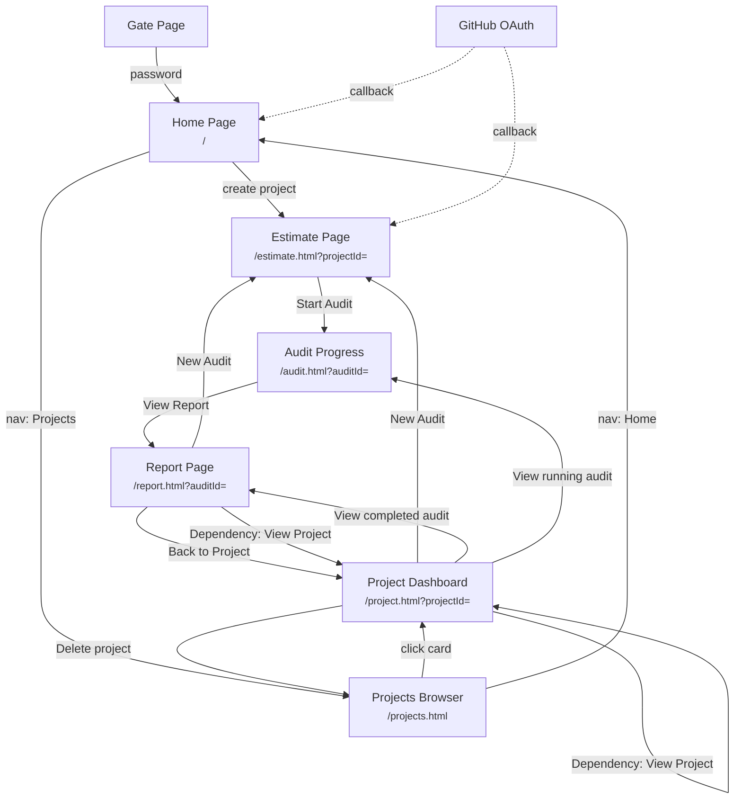

# CodeWatch Product Specification

## Product Vision

CodeWatch is an AI-powered security audit platform for open-source software. It uses Claude Opus 4.5 to perform comprehensive code security reviews with a BYOK (Bring Your Own Key) model, making professional-grade security audits accessible to any OSS project.

Users bring their own Anthropic API key. CodeWatch handles repository cloning, intelligent file selection, multi-batch analysis, finding attribution, and report synthesis -- all driven by Claude.

## Target Users

| Persona | Description | Primary Workflow |
|---------|-------------|-----------------|
| **OSS Maintainers** | Audit their own projects, get security insights, manage findings | Create project, run audit, review full report, triage findings |
| **Security Researchers** | Audit third-party projects, responsible disclosure workflow | Create project for external org, run audit, view redacted report, notify owner |
| **Contributors** | Understand security posture before contributing | Browse public projects, view published reports |

## Capability Map

### Project Management
- **Project creation** -- from GitHub URL, multi-repo, branch selection ([project-creation](flows/project-creation.md))
- **Project browsing** -- search, filter by category/severity, "My Projects" toggle ([projects](views/projects.md))
- **Project dashboard** -- metadata, repos, components, dependencies, audit history ([project](views/project.md))
- **Project deletion** -- creator/owner only, cascade, blocked by foreign audits ([project](views/project.md))

### Security Auditing
- **Cost estimation** -- rough (character-based) and precise (token API) estimates ([estimate](views/estimate.md))
- **Component analysis** -- agentic AI exploration of repo structure, security profiling ([component-analysis](flows/component-analysis.md))
- **Three audit levels** -- full (100%), thorough (~33%), opportunistic (~10%) ([audit-lifecycle](flows/audit-lifecycle.md))
- **Incremental audits** -- diff-based re-analysis with finding inheritance ([audit-lifecycle](flows/audit-lifecycle.md))
- **Real-time progress** -- per-file status, finding counts, phase tracking ([audit](views/audit.md))

### Reporting
- **Three-tier access** -- owner (full), requester (partial redaction), public (summary only) ([report](views/report.md))
- **Findings management** -- severity/status filters, status changes (owner), CWE/CVSS metadata ([report](views/report.md))
- **Report sections** -- executive summary, security posture, threat model, component breakdown, dependencies ([report](views/report.md))
- **Comments** -- audit-level comment threads for owners and requesters ([report](views/report.md))

### Responsible Disclosure
- **Owner notification** -- GitHub issue creation, disclosure timer start ([responsible-disclosure](flows/responsible-disclosure.md))
- **Time-gated publication** -- 3 months (medium/high), 6 months (critical) ([responsible-disclosure](flows/responsible-disclosure.md))
- **Manual publication** -- owner can publish/unpublish at any time ([report](views/report.md))
- **Auto-publication** -- full access for all after disclosure period expires ([responsible-disclosure](flows/responsible-disclosure.md))

### Authentication & Authorization
- **GitHub OAuth** -- `read:org` scope, session-based, 14-day expiry ([authentication](flows/authentication.md))
- **Ownership verification** -- GitHub API membership check, repo permissions fallback, 15-min cache ([authentication](flows/authentication.md))
- **Pre-launch gate** -- password-protected site access via signed cookie ([gate](views/gate.md))

### Supply Chain
- **Dependency detection** -- per-ecosystem grouping, source URL resolution ([component-analysis](flows/component-analysis.md))
- **Project linking** -- link dependencies to existing CodeWatch projects ([project](views/project.md), [report](views/report.md))

## Navigation Map

## Access Control Model

### Three Tiers

| Tier | Who | Determination |
|------|-----|---------------|
| **Owner** | GitHub owner/admin of the audited org, OR anyone when report is public/auto-published | `resolveOwnership()` via GitHub API: personal account match, org admin membership, or repo admin permissions |
| **Requester** | The user who created the project and started the audit | `audit.requester_id === currentUser.id` |
| **Public** | Any unauthenticated or unrelated user | Default when neither owner nor requester |

### Tier Permissions

| Action | Owner | Requester | Public |
|--------|-------|-----------|--------|
| View all findings (full detail) | Yes | Low/info only; medium+ redacted | No (summary only) |
| Change finding status | Yes | No | No |
| Publish / unpublish report | Yes | No | No |
| Notify owner (start disclosure) | No | Yes (if not already notified) | No |
| Post comments | Yes | Yes | No |
| View severity counts & summary | Yes | Yes | Yes |
| Start new audit | Yes (via project) | Yes (via project) | No |
| Delete project | Yes (if creator or org owner) | No | No |

### Ownership Determination

1. **Personal account**: `githubOrg === currentUser.githubUsername` (case-insensitive)
2. **Org admin**: GitHub API `GET /user/memberships/orgs/:org` returns `role: admin, state: active`
3. **Repo admin fallback**: If membership API returns 403, check admin permission on the org's most-starred public repo
4. **Cache**: Results cached for 15 minutes in `ownership_cache` table; invalidated on re-authentication

## View Index

| View | Route | Description | Doc |
|------|-------|-------------|-----|
| Gate | `/gate.html` | Pre-launch password protection | [gate.md](views/gate.md) |
| Home | `/` | Three-step wizard: GitHub URL, repo selection, project creation | [home.md](views/home.md) |
| Projects | `/projects.html` | Browse/search public and personal projects | [projects.md](views/projects.md) |
| Project | `/project.html?projectId=` | Single project dashboard with repos, components, audit history | [project.md](views/project.md) |
| Estimate | `/estimate.html?projectId=` | Cost estimation, component analysis, audit configuration | [estimate.md](views/estimate.md) |
| Audit | `/audit.html?auditId=` | Real-time audit progress with per-file status | [audit.md](views/audit.md) |
| Report | `/report.html?auditId=` | Full audit report with three-tier access control | [report.md](views/report.md) |

## Flow Index

| Flow | Description | Doc |
|------|-------------|-----|
| Authentication | GitHub OAuth, session management, ownership verification | [authentication.md](flows/authentication.md) |
| Project Creation | URL parsing, entity/repo fetching, deduplication, project setup | [project-creation.md](flows/project-creation.md) |
| Component Analysis | Agentic AI repo exploration, component/dependency identification | [component-analysis.md](flows/component-analysis.md) |
| Audit Lifecycle | Estimation, planning, batch analysis, synthesis, incremental audits | [audit-lifecycle.md](flows/audit-lifecycle.md) |
| Responsible Disclosure | Owner notification, time-gated publication, redaction rules | [responsible-disclosure.md](flows/responsible-disclosure.md) |

## Cross-References

- **Engineering specification**: [spec/README.md](../spec/README.md) -- database schema, API contracts, server architecture
- **Known gaps and recommendations**: [gaps.md](gaps.md) -- collected from all product documents
