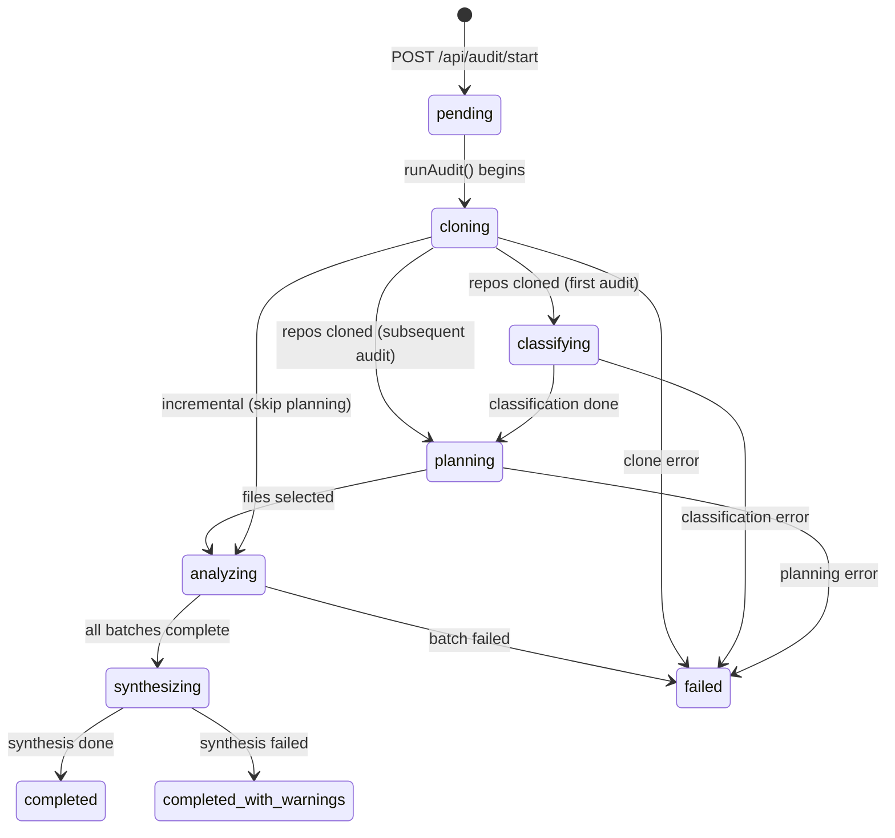
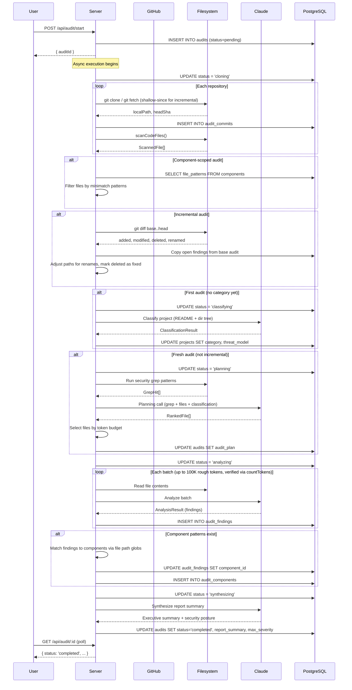

# Audit Lifecycle

## Overview

An audit is the core workflow in CodeWatch: a security analysis of one or more GitHub repositories using Claude as the AI engine. The lifecycle spans estimation, optional component analysis, configuration, execution (clone, classify, plan, analyze, attribute, synthesize), and incremental re-audits.

## Audit Levels

| Level | Budget % | Description |
| ----- | -------- | ----------- |
| `full` | 100% | Analyze all files. Highest cost and coverage. |
| `thorough` | 33% | Analyze ~33% of files, prioritized by security relevance. |
| `opportunistic` | 10% | Analyze ~10% of files, security-critical paths only. |

## Phase 1: Estimation

**API**: `POST /api/estimate`

1. Clone or update each repository in the project (respecting per-repo branch selection).
2. Scan code files (skipping `node_modules`, `.git`, binaries, etc.).
3. Compute rough token counts per file (character-based heuristic).
4. Update `repositories` and `projects` tables with file/token counts.
5. Return cost estimates for all three audit levels, using model pricing from the `model_pricing` table (default: Opus 4.5 at $5/$25 per Mtok).

**Optional Precise Estimation** (`POST /api/estimate/precise`):
- Requires `ANTHROPIC_SERVICE_KEY` server-side config.
- Reads actual file contents, batches them (max 20MB per batch), and calls the `count_tokens` API.
- Returns precise token counts and updated cost estimates with `isPrecise: true`.

### Cost Formula

```
input_tokens  = level_tokens + total_tokens * 0.05  (5% overhead for classification/planning)
output_tokens = input_tokens * 0.15                  (15% output ratio for structured findings)
cost = (input_tokens / 1M) * input_price + (output_tokens / 1M) * output_price
```

## Phase 2: Component Analysis (Optional)

See [component-analysis.md](./component-analysis.md) for the full flow. If performed, components are available for scoped auditing (selecting specific components reduces the file set and cost).

## Phase 3: Configuration

On the estimate page, the user:
1. Reviews cost estimates for each audit level.
2. Optionally selects components (if component analysis has been run).
3. Selects an audit level (`full`, `thorough`, `opportunistic`).
4. Optionally selects a base audit for incremental analysis.
5. Enters their Anthropic API key (`sk-ant-...` format).
6. Clicks "Start Audit".

**API**: `POST /api/audit/start`

Request body:
```json
{
  "projectId": "uuid",
  "level": "thorough",
  "apiKey": "sk-ant-...",
  "baseAuditId": "uuid-or-null",
  "componentIds": ["uuid", "uuid"]
}
```

The server creates an `audits` record and starts the audit asynchronously (non-blocking). Returns `{ auditId }` immediately.

## Phase 4: Execution

The audit runs in the background via `runAudit()` in `/src/server/services/audit.ts`. Status transitions are persisted to the database and polled by the frontend via `GET /api/audit/:id`.

### Step 0: Clone Repositories

**Status**: `cloning`

For each project repository:
1. Clone or update the repo (using `git clone` or `git fetch`).
2. For incremental audits: use `shallow-since` optimization (date of base audit's commit minus 1 day buffer).
3. Record the HEAD commit SHA in `audit_commits`.
4. Scan code files and namespace paths as `repoName/relativePath`.

### Step 0b: Component-Based File Filtering

If `componentIds` were specified:
- Fetch the selected components' `file_patterns` from the database.
- Filter the file list using `minimatch` glob matching against patterns prefixed with the repo name.
- Only matching files proceed to analysis.

### Step 0c: Incremental Diff (if base audit exists)

If `baseAuditId` is provided:
- Retrieve the base audit's commit SHAs per repo.
- Run `git diff --name-status` between base and current commit for each repo.
- Categorize files as added, modified, deleted, or renamed.
- Only added + modified + renamed-to files are analyzed.
- Inherit open findings from the base audit:
  - Deleted files: finding status set to `fixed`.
  - Renamed files: finding file path updated to new path.
  - Duplicate fingerprints are skipped.

### Step 1: Classification (First Audit Only)

**Status**: `classifying`

Skipped if the project already has a `category` (i.e., a previous audit classified it).

Sends to Claude:
- Directory structure of all repos
- README content (truncated to 5000 chars)
- Prompt template: `classify`

Returns `ClassificationResult`:
- `category`: e.g., "library", "cli_tool", "client_server"
- `description`: Natural language summary
- `involved_parties`: Stakeholders
- `threat_model`: Generated or extracted from repo
- `components`: High-level component breakdown

Stored in the `projects` table.

### Step 2: Planning (Smart File Selection)

**Status**: `planning`

Skipped for incremental audits (which use diff-based file selection).

Three sub-steps:

**2a. Local Security Greps**:
Run regex patterns against all files locally (no API call). Categories: injection, SQL, auth, crypto, network, file I/O. Results sorted by hit count descending.

**2b. Claude Planning Call**:
Send grep results + full file list + classification context + component profiles to Claude (Opus 4.5). Claude returns a ranked list of files with priority scores (1-10) and reasons.

**2c. Token-Budget Selection**:
Select files from the ranked list, highest priority first, until the token budget is reached:
- `full`: Include all ranked files (no budget cap).
- `thorough`: 33% of total tokens.
- `opportunistic`: 10% of total tokens.
- At least one file is always included.

Fallback: If planning returns zero files, fall back to heuristic selection (sort by security-critical path patterns).

### Step 3: Batch Analysis

**Status**: `analyzing`

1. **Batching**: Group selected files into batches of up to 100,000 rough tokens each, sorted by directory path to keep related code together. Before each batch is sent to Claude, the exact token count is verified via the free `countTokens` API. If the exact count exceeds 195,000 tokens (API limit minus margin), the batch is automatically split in half and re-queued.
2. **Per-batch analysis**: For each batch:
   - Build a user message with full file contents.
   - For incremental audits: include context about previous findings for modified files.
   - Call Claude with the system prompt (built from classification + level-specific instructions).
   - Parse the JSON response as `AnalysisResult` with findings.
   - Insert findings into `audit_findings`, generating a SHA-256 fingerprint for each finding.
   - For incremental audits: skip findings whose fingerprint already exists (inherited from base).
3. **Failure handling**: If any batch fails, the audit stops immediately and is marked as `failed`. Partial results are not considered reliable for security audits.

### Step 3b: Component Attribution

After all batches complete, if component patterns exist:
- Match each finding's `file_path` against component `file_patterns` using `minimatch`.
- First matching component wins.
- Update `audit_findings.component_id` and insert `audit_components` records with token and finding counts.

### Step 4: Synthesis

**Status**: `synthesizing`

1. Query all findings for this audit.
2. Send a summary to Claude with the `synthesize` prompt template.
3. Parse the response as the executive summary / security posture.
4. Compute `max_severity` from all findings.
5. Update the audit record with `report_summary`, `max_severity`, `actual_cost_usd`, and `status = 'completed'`.

If synthesis fails, the audit completes with `status = 'completed_with_warnings'` -- findings are still available but no executive summary is generated.

## Status Transitions



## Incremental Audit Details

Incremental audits inherit from a base audit:

| Aspect | Behavior |
| ------ | -------- |
| File selection | Only added + modified + renamed files are analyzed |
| Inherited findings | Open findings from base audit are copied to new audit |
| Deleted files | Inherited findings marked as `fixed` |
| Renamed files | Inherited finding paths updated to new path |
| Deduplication | SHA-256 fingerprint prevents duplicate findings |
| Planning | Skipped (diff replaces planning) |
| Classification | Skipped (reuses project classification) |
| Shallow clone | Uses `shallow-since` based on base commit date minus 1 day |

### Finding Fingerprint

```
SHA-256(file_path : line_range : title : first_100_chars_of_code_snippet)
```
Truncated to 16 hex characters.

## Sequence Diagram



**Related spec:** [services/audit.md](../../spec/services/audit.md), [services/planning.md](../../spec/services/planning.md), [services/tokens.md](../../spec/services/tokens.md), [api.md](../../spec/api.md)

## Key Files

| File | Purpose |
| ---- | ------- |
| `/src/server/services/audit.ts` | Main `runAudit()` orchestrator, classification, batching, synthesis |
| `/src/server/services/planning.ts` | `runPlanningPhase`, security greps, Claude planning call, budget selection |
| `/src/server/services/tokens.ts` | Cost estimation, `BUDGET_PERCENTAGES`, `SECURITY_CRITICAL_PATTERNS` |
| `/src/server/services/git.ts` | `cloneOrUpdate`, `scanCodeFiles`, `diffBetweenCommits` |
| `/src/server/services/claude.ts` | `callClaude`, `countTokens`, `parseJsonResponse` |
| `/src/server/routes/api.ts` | `POST /api/audit/start`, `POST /api/estimate`, `GET /api/audit/:id` |
