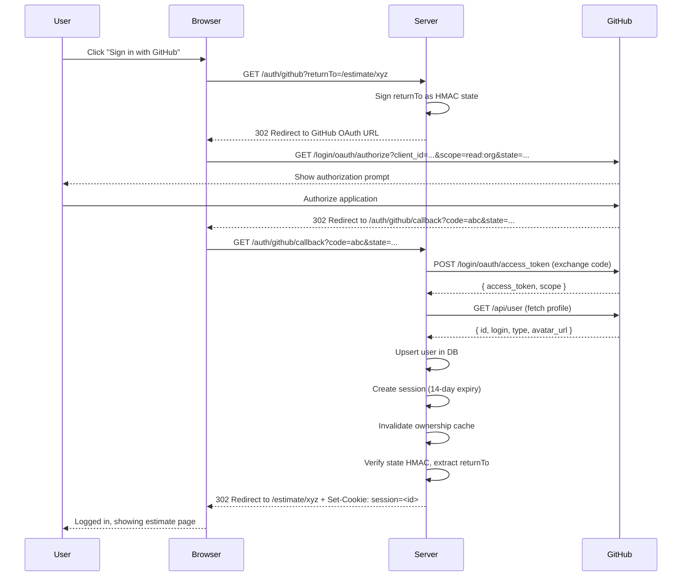

# Authentication Flow

## Overview

CodeWatch uses GitHub OAuth for authentication. Users authenticate via their GitHub account, which also enables ownership verification for organizations and repositories. The system requests the `read:org` scope to verify org membership.

## OAuth Flow

1. **Initiate**: User clicks "Sign in with GitHub" on the frontend.
2. **Redirect to GitHub**: The server generates a GitHub OAuth URL with:
   - `client_id` from config
   - `redirect_uri` pointing to `/auth/github/callback`
   - `scope: read:org`
   - Optional `state` parameter (HMAC-signed `returnTo` path for post-login redirect)
3. **User authorizes**: GitHub prompts the user to grant permissions.
4. **Callback**: GitHub redirects to `/auth/github/callback` with a `code` parameter.
5. **Token exchange**: Server exchanges the code for an access token via `POST https://github.com/login/oauth/access_token`.
6. **Fetch user info**: Server calls `GET https://api.github.com/user` with the token.
7. **Upsert user**: Server creates or updates the user record in the `users` table (keyed by `github_id`).
8. **Create session**: Server inserts a session row in the `sessions` table with the GitHub token and `has_org_scope` flag.
9. **Set cookie**: Server sets an `httpOnly` session cookie.
10. **Redirect**: Server redirects to the `returnTo` path (from signed state) or `/`.

## Session Management

| Property       | Value                                           |
| -------------- | ----------------------------------------------- |
| Cookie name    | `session`                                       |
| Cookie flags   | `httpOnly`, `secure` (production), `sameSite=lax` |
| Max age        | 14 days (`config.sessionMaxAgeDays`)            |
| Storage        | PostgreSQL `sessions` table                     |
| Session ID     | UUID (database-generated)                       |
| Expiry check   | `expires_at > NOW()` on every authenticated request |

## Org Scope (`read:org`)

The `read:org` scope is requested during OAuth to enable ownership verification for GitHub organizations. After the callback, the server parses the granted scopes from the token exchange response and stores `has_org_scope` in the session.

If the scope is missing (e.g., user denied it), ownership checks for organizations may fail, and the user will be prompted to re-authenticate with the correct scope.

## Ownership Verification

Ownership is resolved via `resolveOwnership()` in `/src/server/services/ownership.ts`. The logic:

1. **Cache check**: Query `ownership_cache` table (15-minute TTL). Return immediately on cache hit.
2. **Personal account**: If `githubOrg` matches the user's `githubUsername` (case-insensitive), the user is the owner with role `personal`.
3. **Org membership API**: Call `GET https://api.github.com/user/memberships/orgs/:org`. If the response shows `role: admin` and `state: active`, the user is an owner.
4. **Repo permissions fallback**: If the membership API returns 403 (third-party app restrictions), fall back to checking repo permissions. Fetch the org's most-starred public repo and check if the user has `admin` permission.
5. **Cache result**: Store in `ownership_cache` (unless `needsReauth` is true). TTL is 15 minutes.

### Ownership Roles

| Role       | Meaning                                          |
| ---------- | ------------------------------------------------ |
| `personal` | The GitHub org/user name matches the logged-in user |
| `admin`    | User is an active admin of the GitHub organization  |
| `member`   | User is a non-admin member of the organization      |

Only `personal` and `admin` roles grant `isOwner: true`.

## Logout

`POST /auth/logout`:
1. Deletes the session row from the `sessions` table.
2. Clears the `session` cookie.
3. Returns `{ ok: true }`.

## Re-authentication

When the system detects `needsReauth` (e.g., org scope missing for an ownership check):
- The `needsReauth` flag is returned in API responses.
- The frontend redirects to `/auth/github?returnTo=<current_path>`.
- The `returnTo` is HMAC-signed with the cookie secret to prevent open redirects. Only relative paths starting with `/` (and not `//`) are allowed.
- On re-auth, `invalidateOwnershipCache()` clears all cached ownership entries for the user, forcing fresh GitHub API lookups.

## Auth Middleware

`requireAuth` middleware (`/src/server/routes/auth.ts`):
1. Reads the `session` cookie.
2. Queries the `sessions` + `users` tables (checks `expires_at > NOW()`).
3. If valid, attaches `userId`, `githubToken`, `githubUsername`, `githubType`, and `hasOrgScope` to the request object.
4. If invalid or expired, returns `401`.

## Sequence Diagram

## Key Files

| File | Purpose |
| ---- | ------- |
| `/src/server/routes/auth.ts` | OAuth routes, session management, `requireAuth` middleware |
| `/src/server/services/github.ts` | `getOAuthUrl`, `exchangeCodeForToken`, `getAuthenticatedUser`, `checkGitHubOwnership` |
| `/src/server/services/ownership.ts` | `resolveOwnership`, ownership cache logic |
| `/src/server/config.ts` | `sessionMaxAgeDays` (14), cookie secret, GitHub client credentials |
