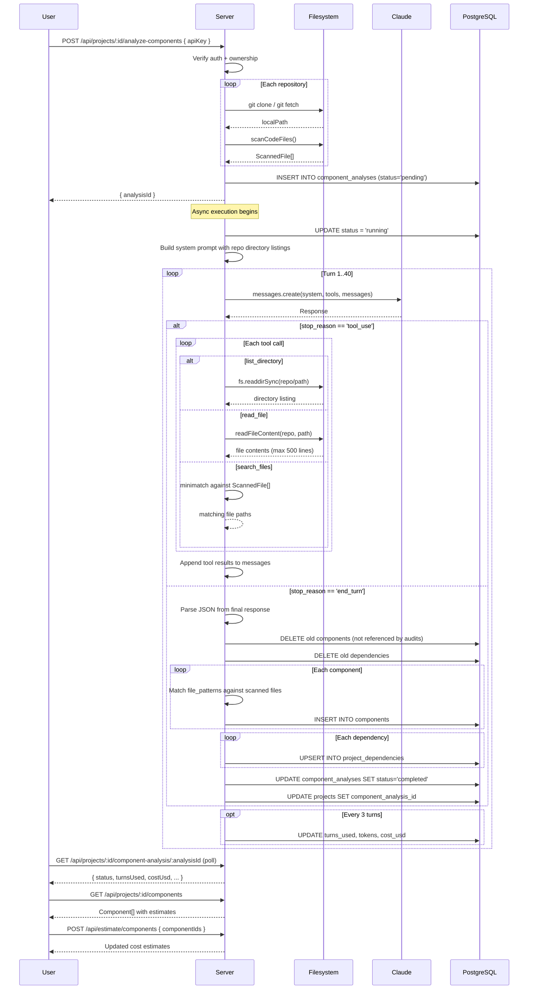

# Component Analysis Flow

## Overview

Component analysis is an optional, AI-driven step that identifies architectural components, their security profiles, and project dependencies. It uses an agentic loop where Claude explores repository contents using tools, then produces a structured breakdown that enables scoped auditing.

## Prerequisites

- A project must exist with at least one repository.
- The user must be authenticated and be the project creator or a verified GitHub owner.
- The user must provide a valid Anthropic API key (`sk-ant-...` format).
- Repositories must be cloneable (the endpoint clones them during the request).

## Flow

### Step 1: User Enters API Key

On the estimate page, the user enters their Anthropic API key. The key is validated client-side (must start with `sk-ant-`) and passed to the server.

### Step 2: User Clicks "Analyze Components"

**API**: `POST /api/projects/:id/analyze-components`

Request body:
```json
{
  "apiKey": "sk-ant-..."
}
```

Server-side:
1. Verify project exists and user has permission (creator or owner).
2. Clone/update all project repositories.
3. Scan code files from each repository.
4. Create a `component_analyses` record with `status = 'pending'`.
5. Start the analysis asynchronously (non-blocking).
6. Return `{ analysisId }` immediately.

### Step 3: Agentic Analysis Loop

The analysis runs in the background via `runComponentAnalysis()` in `/src/server/services/componentAnalysis.ts`.

**Model**: Claude Opus 4.5 (`claude-opus-4-5-20251101`)
**Pricing**: $5/Mtok input, $25/Mtok output
**Max turns**: 40
**Max output tokens per turn**: 16,384

#### System Prompt

Built from the `component_analysis` prompt template, pre-populated with the top-level directory listing of each repository (excluding skipped directories like `node_modules`, `.git`).

#### Initial User Message

```
Please analyze the repositories listed above using the provided tools.
Explore the structure, identify components with security profiles,
and detect dependencies. Output your final analysis as JSON.
```

#### Agentic Loop

```
while (turnsUsed < 40):
    response = Claude.messages.create(system, tools, messages)
    turnsUsed++

    if response.stop_reason == 'end_turn':
        // Extract final JSON from text content
        // Store results and mark completed
        break

    if response.stop_reason == 'tool_use':
        // Execute each tool call
        // Append results to messages
        continue

    // Unexpected stop_reason: break and fail
```

#### Available Tools

| Tool | Description | Parameters |
| ---- | ----------- | ---------- |
| `list_directory` | List files and directories at a path in a repository. Returns entry names with sizes for files and trailing `/` for directories. | `repo_name`, `path` |
| `read_file` | Read file contents (truncated at 500 lines). | `repo_name`, `path` |
| `search_files` | Search for code files matching a glob pattern. Only searches indexed code files. | `repo_name`, `pattern` |

All tools include path traversal protection (resolved paths must stay within the repository root).

#### Tool Execution Safety

- Each tool call is wrapped in a try/catch.
- On error, an `is_error: true` tool result is returned to Claude.
- **Consecutive error tracking**: If 5 consecutive tool calls produce errors, the analysis is aborted with an error message.
- On success, the consecutive error counter resets to 0.

#### Retry Logic

API calls to Claude include retry logic for transient errors:
- **Rate limits (429)**: Wait for `Retry-After` header value + 5 seconds.
- **Server errors (5xx)**: Exponential backoff (10s, 20s, 40s, 80s, 120s cap).
- **Max retries**: 5 per API call.

### Step 4: Progress Polling

**API**: `GET /api/projects/:id/component-analysis/:analysisId`

The frontend polls this endpoint to display progress:

```json
{
  "id": "uuid",
  "projectId": "uuid",
  "status": "running",
  "turnsUsed": 12,
  "maxTurns": 40,
  "inputTokensUsed": 245000,
  "outputTokensUsed": 18000,
  "costUsd": 1.675,
  "errorMessage": null,
  "createdAt": "...",
  "completedAt": null
}
```

Progress is updated in the database every 3 turns (to reduce DB roundtrips) and on the final turn.

### Step 5: Results Stored

When Claude returns `stop_reason: 'end_turn'`, the final text content is parsed as JSON with the structure:

```typescript
interface ComponentAnalysisResult {
  components: ComponentData[];
  dependencies?: DependencyData[];
}

interface ComponentData {
  name: string;
  description: string;
  role: string;
  repo: string;
  file_patterns: string[];    // Glob patterns like "src/auth/**"
  languages: string[];
  security_profile?: {
    summary: string;
    sensitive_areas: Array<{ path: string; reason: string }>;
    threat_surface: string[];
  };
}

interface DependencyData {
  name: string;
  version?: string;
  ecosystem: string;           // e.g., "npm", "pip", "cargo"
  repo: string;
  source_repo_url?: string;
}
```

Storage:
1. **Clean up**: Delete old components not referenced by any audit. Delete all old dependencies.
2. **Insert components**: For each component, match `file_patterns` against scanned files to compute `estimated_files` and `estimated_tokens`.
3. **Insert dependencies**: Upsert into `project_dependencies` with deduplication on `(project_id, repo_id, name, ecosystem)`.
4. **Update project**: Set `component_analysis_id` and `components_analyzed_at`.

### Step 6: User Selects Components

**API**: `GET /api/projects/:id/components`

The frontend displays a table of components with:
- Name, description, role
- Repository name
- File patterns and languages
- Security profile summary
- Estimated files and tokens
- Checkboxes for selection

The user selects components to scope the audit. Unselected components are excluded from the file set.

### Step 7: Cost Estimate Updates

**API**: `POST /api/estimate/components`

When component selection changes, the frontend requests updated cost estimates:

```json
{
  "projectId": "uuid",
  "componentIds": ["uuid", "uuid"],
  "totalTokens": 500000
}
```

The server sums `estimated_files` and `estimated_tokens` from the selected components and recomputes cost estimates for all three audit levels.

## Error Handling

| Error | Behavior |
| ----- | -------- |
| 5 consecutive tool errors | Analysis aborted, `status = 'failed'` |
| Max turns (40) reached | Analysis aborted, `status = 'failed'` |
| API rate limit | Retry with backoff (up to 5 retries) |
| Server error (5xx) | Retry with exponential backoff |
| Invalid JSON from Claude | `parseJsonResponse` throws, analysis fails |
| Clone failure | `POST` endpoint returns 500 before analysis starts |

## Sequence Diagram



**Related spec:** [services/componentAnalysis.md](../../spec/services/componentAnalysis.md), [api.md](../../spec/api.md), [database.md](../../spec/database.md)

## Key Files

| File | Purpose |
| ---- | ------- |
| `/src/server/services/componentAnalysis.ts` | `runComponentAnalysis()`, tool definitions, tool execution, result storage |
| `/src/server/routes/api.ts` | `POST /api/projects/:id/analyze-components`, `GET /api/projects/:id/component-analysis/:analysisId`, `GET /api/projects/:id/components`, `POST /api/estimate/components` |
| `/src/server/services/tokens.ts` | `estimateCostsForComponents()` |
| `/src/server/services/git.ts` | `readFileContent()`, `scanCodeFiles()`, `SKIP_DIRS` |
