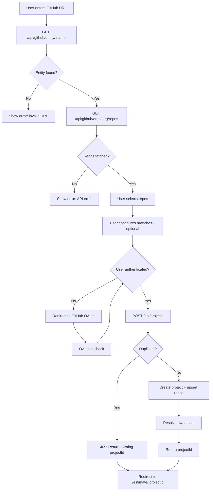

# Project Creation Flow

## Overview

A project in CodeWatch represents a GitHub user or organization and a selection of their repositories. Project creation is the entry point for all auditing workflows.

## End-to-End Flow

### Step 1: Enter GitHub URL

The user enters a GitHub URL (e.g., `https://github.com/acme-corp`) on the home page. The frontend extracts the entity name (`acme-corp`).

### Step 2: Fetch Entity Info

**API**: `GET /api/github/entity/:name`

The server calls the GitHub API (`GET https://api.github.com/users/:name`) to retrieve:
- `login`: The canonical GitHub username/org name
- `type`: `User` or `Organization`
- `avatarUrl`: Profile avatar

If the user is authenticated, the server also resolves ownership via `resolveOwnership()` and returns:
- `isOwner`: Whether the logged-in user owns this entity
- `role`: `personal`, `admin`, or `member`
- `needsReauth`: Whether re-authentication is needed for ownership verification

### Step 3: Fetch Repository List

**API**: `GET /api/github/orgs/:org/repos`

The server fetches public repositories. It tries the org endpoint first (`/orgs/:org/repos`); if that returns 404, it falls back to the user endpoint (`/users/:username/repos`). Repositories are paginated (100 per page) and sorted by stars descending.

Each repo includes: `name`, `description`, `language`, `stars`, `forks`, `defaultBranch`, `license`, `url`, `githubId`.

### Step 4: Select Repositories

The user selects one or more repositories from the list (multi-select with search). This is a client-side interaction.

### Step 5: Configure Branches (Optional)

**API**: `GET /api/github/repos/:owner/:repo/branches`

For each selected repo, the user can optionally select a specific branch. The branch list is fetched via GitHub's GraphQL API, sorted by most recent commit date. The default branch is placed first. If no branch is selected, the repo's default branch is used.

### Step 6: Authentication Required

The user must be authenticated to create a project. The `POST /api/projects` endpoint uses the `requireAuth` middleware. If the user is not logged in, the frontend redirects to the auth flow with a `returnTo` parameter.

### Step 7: Create Project

**API**: `POST /api/projects`

Request body:
```json
{
  "githubOrg": "acme-corp",
  "repos": [
    { "name": "api-server", "branch": "develop", "defaultBranch": "main" },
    { "name": "frontend" }
  ]
}
```

Server-side processing:
1. **Validate inputs**: Check `githubOrg` format (`^[a-zA-Z0-9](?:[a-zA-Z0-9-]*[a-zA-Z0-9])?$`), validate each repo name (`^[a-zA-Z0-9._-]+$`), and validate branch strings.
2. **Deduplication check**: Query for an existing project with the same `github_org`, `created_by`, and identical sorted repo names.
3. **Create project**: Insert into `projects` table with `name` defaulting to the org name.
4. **Upsert repositories**: For each repo, upsert into the `repositories` table (keyed by `repo_url`), then link via `project_repos` with the optional branch.
5. **Resolve ownership**: Check if the creator is the owner of the GitHub entity.
6. **Return**: `{ projectId, repos, ownership }`.

### Step 8: Redirect to Estimate Page

On success, the frontend redirects to the estimate page (`/estimate/:projectId`).

## Deduplication Logic

The server prevents duplicate projects by checking if the same user already has a project with:
- The same `github_org`
- The same set of repo names (sorted alphabetically, joined by comma)

```sql
SELECT p.id FROM projects p
WHERE p.github_org = $1 AND p.created_by = $2
AND (
  SELECT string_agg(r.repo_name, ',' ORDER BY r.repo_name)
  FROM project_repos pr JOIN repositories r ON r.id = pr.repo_id
  WHERE pr.project_id = p.id
) = $3
```

If a duplicate is found, the server returns `409 Conflict` with the existing project ID:
```json
{ "projectId": "existing-uuid", "existing": true, "message": "Project already exists" }
```

Note: Branch selection is not part of the deduplication key. Two projects with the same repos but different branches are considered duplicates.

## Error Cases

| Error | Status | Cause |
| ----- | ------ | ----- |
| `githubOrg and repos[] are required` | 400 | Missing required fields |
| `Invalid GitHub org/user name` | 400 | Name contains special characters |
| `Invalid repository name: ...` | 400 | Repo name with invalid characters |
| `Invalid branch for ...` | 400 | Empty string branch |
| `Authentication required` | 401 | No session cookie or expired session |
| `Project already exists` | 409 | Duplicate project (same org + repos + user) |
| `Failed to fetch GitHub entity` | 500 | GitHub API error (rate limit, network) |
| `Failed to list organization repositories` | 500 | GitHub API error on repo listing |
| `Failed to create project` | 500 | Database error |

## Flowchart



## Key Files

| File | Purpose |
| ---- | ------- |
| `/src/server/routes/api.ts` | `POST /api/projects`, `GET /api/github/entity/:name`, `GET /api/github/orgs/:org/repos`, `GET /api/github/repos/:owner/:repo/branches` |
| `/src/server/services/github.ts` | `getGitHubEntity`, `listOrgRepos`, `listUserRepos`, `listRepoBranches`, `getRepoDefaultBranch` |
| `/src/server/services/git.ts` | `repoLocalPath` (compute local clone path) |
| `/src/server/services/ownership.ts` | `resolveOwnership` for creator ownership |
