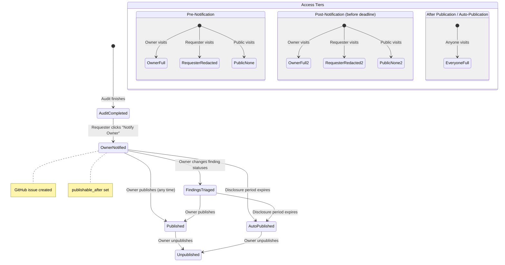

# Responsible Disclosure Flow

## Overview

CodeWatch implements a responsible disclosure workflow for when a community member (the "requester") runs a security audit on someone else's project. The system protects the project owner by redacting sensitive findings and enforcing time-gated publication based on severity.

## Actors

| Actor | Description |
| ----- | ----------- |
| **Requester** | The user who initiated and paid for the audit. |
| **Owner** | The GitHub user/org that owns the audited repositories. Verified via GitHub API. |
| **Public** | Any unauthenticated or unrelated user viewing the report. |

## Disclosure Timeline

### Step 1: Requester Runs Audit

The requester creates a project targeting another user/org's repositories and starts an audit. The system records `requester_id` and `is_owner` on the audit record. When the requester is not the owner, `is_owner = false`.

### Step 2: Audit Completes -- Requester Sees Redacted Report

After the audit completes, the requester can view the report at `GET /api/audit/:id/report`. As a non-owner requester, they receive:
- **Full access** to `low` and `informational` findings (all fields visible).
- **Redacted** `medium`, `high`, and `critical` findings: only `severity`, `cweId`, `repoName`, and `status` are visible. All other fields (`title`, `description`, `exploitation`, `recommendation`, `codeSnippet`, `filePath`, `lineStart`, `lineEnd`, `cvssScore`) are set to `null`.
- A `redactionNotice` explaining the policy.
- The `reportSummary` (executive summary) is visible.
- Severity counts are visible at all tiers.

### Step 3: Requester Clicks "Notify Owner"

**API**: `POST /api/audit/:id/notify-owner`

Prerequisites:
- Audit must have `status = 'completed'`.
- Only the audit requester (`requester_id`) can trigger notification.

Actions:
1. **Create GitHub Issue**: On the most-starred repository in the project, using the requester's GitHub token. The issue includes the finding count, max severity, audit ID, and a link to CodeWatch.
2. **Set `publishable_after`**: Based on max severity:

   | Max Severity | Disclosure Delay |
   | ------------ | ---------------- |
   | `critical` | 6 months |
   | `high` | 3 months |
   | `medium` | 3 months |
   | `low` | No delay (`null`) |
   | `informational` | No delay (`null`) |
   | `none` | No delay (`null`) |

3. **Record notification**: Set `owner_notified = TRUE` and `owner_notified_at = NOW()`.

### Step 4: Owner Receives Notification

The owner sees the GitHub issue in their repository. The issue body explains that a community member ran a security audit and directs them to CodeWatch.

### Step 5: Owner Views Full Report

When the owner visits the report page, the system verifies ownership via `resolveOwnership()` (GitHub API check). As an owner, they receive the full report with all findings unredacted, including `exploitation`, `codeSnippet`, and `recommendation` fields.

### Step 6: Owner Actions

The owner can:
- **Publish the report**: `POST /api/audit/:id/publish` sets `is_public = TRUE`. This makes the full report visible to everyone immediately.
- **Unpublish the report**: `POST /api/audit/:id/unpublish` sets `is_public = FALSE` and clears `publishable_after`.
- **Change finding statuses**: `PATCH /api/findings/:id/status` with one of:
  - `open` (default)
  - `fixed` (vulnerability has been patched)
  - `false_positive` (not a real vulnerability)
  - `accepted` (known risk, accepted)
  - `wont_fix` (will not be addressed)

### Step 7: Auto-Publication After Disclosure Period

After the `publishable_after` date passes (and `owner_notified` is true):
- The system treats the report as auto-published.
- The `resolveAccessTier()` function checks: `if (publishableAfter && audit.owner_notified && now >= publishableAfter)` then `fullAccessForAll = true`.
- At this point, anyone (including the public) gets `owner`-tier access to the full report.

Note: The owner can still unpublish the report after auto-publication, which clears `publishable_after`.

## Three-Tier Access Control

### Access Tier Resolution

```typescript
function resolveAccessTier(audit, requesterId, isOwner): AccessTier {
  const isAutoPublished = publishableAfter && audit.owner_notified && now >= publishableAfter;
  const fullAccessForAll = audit.is_public || isAutoPublished;

  if (fullAccessForAll || isOwner) return 'owner';
  if (requesterId === audit.requester_id) return 'requester';
  return 'public';
}
```

### Tier Details

| Tier | Who | Findings Visible | Details Visible | Summary |
| ---- | --- | ---------------- | --------------- | ------- |
| **Owner** | GitHub owner of the entity, OR anyone when report is public/auto-published | All severities | All fields | Yes |
| **Requester** | The user who started and paid for the audit | All severities | Low/Informational: full. Medium/High/Critical: severity + CWE + status only | Yes |
| **Public** | Everyone else | None (empty array) | None | Yes (severity counts only) |

### Redaction Rules by Tier

**Owner tier** (full access):
- All findings returned with all fields populated.
- Can change finding statuses, publish/unpublish.

**Requester tier** (partial redaction):
- Low and Informational findings: all fields visible.
- Medium, High, and Critical findings: only these fields are returned:
  - `id`, `severity`, `cweId`, `repoName`, `status`
  - All other fields set to `null`: `cvssScore`, `title`, `description`, `exploitation`, `recommendation`, `codeSnippet`, `filePath`, `lineStart`, `lineEnd`
- `redactionNotice`: "Some finding details are redacted. By requesting this audit you are supporting the security of this project. Full findings will be available after the responsible disclosure period, or when the owner publishes the report."

**Public tier** (no findings):
- `findings` array is empty.
- `redactedSeverities`: all severity levels.
- `redactionNotice`: "Only project owners can see the full report. Finding count and severity summary are shown below."
- `severityCounts` and `reportSummary` are still visible.

## Idempotency

The `POST /api/audit/:id/notify-owner` endpoint is idempotent:
- If `owner_notified` is already `true`, it returns the existing `publishable_after` date with `alreadyNotified: true`.
- The GitHub issue is only created on the first call.
- Subsequent calls do not create additional issues or modify `publishable_after`.

## State Diagram



## Error Handling

| Error | Status | Cause |
| ----- | ------ | ----- |
| `Audit must be completed before notifying the owner` | 400 | Audit still running or failed |
| `Only the audit requester can notify the owner` | 403 | Non-requester trying to notify |
| `Only the project owner can publish` | 403 | Non-owner trying to publish |
| `Re-authentication required to verify ownership` | 403 | Session lacks org scope |
| GitHub issue creation failure | Logged | Issue creation continues silently; notification is still recorded |

## Key Files

| File | Purpose |
| ---- | ------- |
| `/src/server/routes/api.ts` | `POST /api/audit/:id/notify-owner`, `POST /api/audit/:id/publish`, `POST /api/audit/:id/unpublish`, `PATCH /api/findings/:id/status`, `GET /api/audit/:id/report` |
| `/src/server/routes/api.ts` (lines 50-68) | `resolveAccessTier()`, `getRedactedSeverities()` |
| `/src/server/services/github.ts` | `createIssue()` for GitHub issue creation |
| `/src/server/services/ownership.ts` | `resolveOwnership()` for owner verification |
