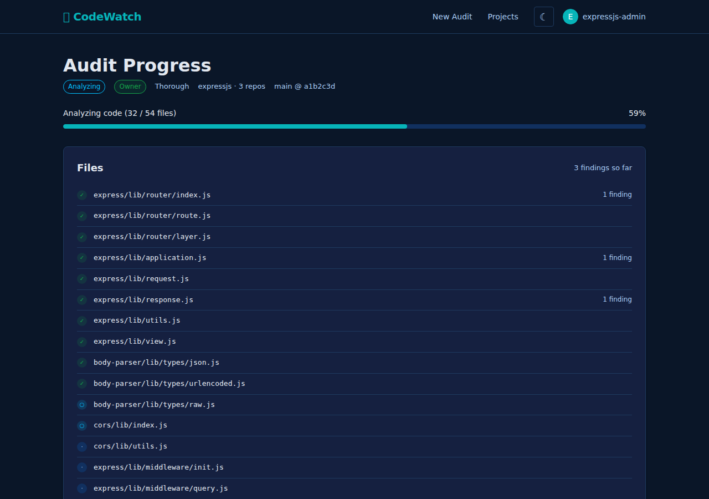

# Audit Progress View

**Purpose:** Real-time display of audit execution progress, showing per-file analysis status as the backend processes a security audit.

**Route:** `/audit.html?auditId={auditId}`

**Screenshot:** 

**Source files:**
- `public/audit.html`
- `src/client/audit.ts`

**Related spec:** [client/audit.md](../../spec/client/audit.md), [services/audit.md](../../spec/services/audit.md), [api.md](../../spec/api.md)

---

## Navigation Context

- **Comes from:** Estimate page (after user confirms and starts audit)
- **Goes to:** Report page (`/report.html?auditId={auditId}`) via "View Report" button on completion

---

## Page Structure

### Header

Displays metadata about the running audit:

| Element | ID | Content |
|---|---|---|
| Status badge | `audit-status-badge` | Colored badge: `badge-pending`, `badge-running`, `badge-completed`, or `badge-failed` depending on phase |
| Owner badge | `audit-owner-badge` | Rendered via `renderOwnershipBadge()` if `isOwner` is true |
| Audit level | `audit-level` | Text label (e.g., "full", "thorough", "opportunistic") |
| Commit SHA | `audit-commit` | Format: `repoName@abc1234`, comma-separated if multiple repos |
| Type | `audit-type` | Shows `<span class="badge badge-running">incremental</span>` if `isIncremental` is true; empty otherwise |

### Progress Section

Shows overall audit progress:

- **Status text** (`progress-text`): Human-readable phase label that changes through the audit lifecycle:
  - `pending` -- "Waiting to start..."
  - `cloning` -- "Cloning repositories..." (enhanced to "Cloning repositories (1/5: repo-name)..." when `progressDetail` provides clone progress)
  - `classifying` -- "Classifying software..."
  - `planning` -- "Planning analysis..."
  - `estimating` -- "Estimating scope..."
  - `analyzing` -- "Analyzing code (X/Y files)"
  - `synthesizing` -- "Generating report..."
  - `completed` -- "Audit complete"
  - `completed_with_warnings` -- "Audit complete (with warnings)"
  - `failed` -- "Audit failed"
- **File count** (`progress-count`): "X / Y files" where X = `filesAnalyzed`, Y = `filesToAnalyze` (falls back to `totalFiles`)
- **Progress bar** (`progress-fill`): Width set to `round((done / total) * 100)%`

### File List

Card containing a `<ul>` of files extracted from `progressDetail` via type discrimination. Files are only rendered when `progressDetail.type` is `analyzing` or `done`; unknown or missing types are silently ignored (no crash). On terminal states (`failed`, `completed`, `completed_with_warnings`) without file data, the loading spinner is cleared. Each file item shows:

| Status | Icon | CSS class |
|---|---|---|
| pending | `·` (middle dot, U+00B7) | `file-status-pending` |
| analyzing | `○` (white circle, U+25CB) | `file-status-analyzing` |
| done | `✓` (check mark, U+2713) | `file-status-done` |
| error | `✗` (ballot X, U+2717) | `file-status-error` |

Each item: `[status icon] [filename] [N finding(s)]` -- finding count shown only if > 0.

The card header also shows a total **findings summary** (`findings-summary`): e.g., "12 findings". Falls back to 0 if file data is unavailable or in an unknown format.

### Warnings Section

Hidden until `progressDetail.warnings` contains one or more entries. Displayed between the file list and the completion card.

- **Container:** `warnings-notice` (hidden by default)
- **Content:** `<ul>` with id `warnings-list`, each `<li>` is an escaped warning string from `progressDetail.warnings`
- **Example warnings:** "diff failed for repo, auditing all files", "Planning phase returned no files"

Warnings accumulate across phases -- each `progressDetail` variant carries a `warnings: string[]` field.

### Completion Card

Hidden until `status === 'completed'` or `status === 'completed_with_warnings'`. Contains:

- **Heading:** "Audit Complete"
- **Summary text:** "Found N finding(s). Max severity: {maxSeverity}." Appends warning note for `completed_with_warnings`.
- **"View Report" button:** Links to `/report.html?auditId={id}`

### Error State

Hidden until `status === 'failed'` and `errorMessage` is present. Shows:

- Red notice: "Audit failed: {errorMessage}"

---

## Polling Behavior

- **Interval:** 3 seconds (`setInterval(poll, 3000)`)
- **API endpoint:** `GET /api/audit/{auditId}` (returns `AuditStatus` object)
- **Stops polling** when status is `completed`, `completed_with_warnings`, or `failed`. Terminal status is checked **before** rendering, so polling stops correctly even if rendering throws an error.
- **Visibility-aware** (Issue #26): When tab becomes hidden (`document.hidden`), polling interval is cleared. When tab becomes visible again, polling resumes immediately (one instant poll + restart interval).
- **Error resilience:** Tracks `consecutiveErrors`. After 5 consecutive poll failures, stops polling and shows error: "Lost connection to audit status after 5 consecutive errors. Please refresh the page." Counter resets on any successful poll.

---

## Data Model

```typescript
interface AuditStatus {
  id: string;
  projectId: string;
  projectName: string;
  githubOrg: string;
  status: string;              // pending | cloning | classifying | planning | estimating | analyzing | synthesizing | completed | completed_with_warnings | failed
  auditLevel: string;
  isIncremental: boolean;
  isOwner: boolean;
  isRequester: boolean;
  totalFiles: number;
  filesToAnalyze: number;
  filesAnalyzed: number;
  progressDetail: ProgressDetail | null;  // discriminated union, see below
  commits: Array<{ repoName: string; commitSha: string; branch: string }>;
  maxSeverity: string | null;
  errorMessage: string | null;
  createdAt: string;
  startedAt: string | null;
  completedAt: string | null;
}

// ProgressDetail is a discriminated union on the `type` field.
// All variants carry a `warnings: string[]` field.

interface ProgressBase {
  warnings: string[];
}

interface ProgressCloning extends ProgressBase {
  type: 'cloning';
  current: number;       // 1-based index of repo being cloned
  total: number;         // total repos to clone
  repoName: string;      // name of repo currently being cloned
}

interface ProgressPlanning extends ProgressBase {
  type: 'planning';
}

interface ProgressAnalyzing extends ProgressBase {
  type: 'analyzing';
  files: FileProgress[];
}

interface ProgressDone extends ProgressBase {
  type: 'done';
  files: FileProgress[];
}

type ProgressDetail = ProgressCloning | ProgressPlanning | ProgressAnalyzing | ProgressDone;

interface FileProgress {
  file: string;
  status: string;            // pending | analyzing | done | error
  findingsCount: number;
}
```

---

## Gaps and Recommendations

- [GAP] No retry button when polling stops after 5 consecutive errors -- user must manually refresh the page.
- [REC] Add a "Retry" button alongside the error message that resets `consecutiveErrors` and restarts polling.

- [GAP] No elapsed time or ETA display. The user sees file counts but has no sense of how long the audit has been running or how long it might take.
- [REC] Show elapsed time since `startedAt` and optionally estimate remaining time based on `filesAnalyzed / filesToAnalyze` rate.

- [GAP] The `estimating` status is included in the DB CHECK constraint and the client status label map, but no server code ever sets this status. It is dead code in the current implementation.
- [REC] Either remove `estimating` from the status label map and DB constraint, or implement it as a distinct phase between planning and analyzing.

- [GAP] No cancel/abort capability. Once an audit starts, there is no UI mechanism to stop it.
- [REC] Add a "Cancel Audit" button (owner-only) that calls a cancel API endpoint.

- [GAP] `isRequester` is returned in the API response but never used on this page. Requesters see the same view as unauthenticated users.
- [REC] Consider showing requester-specific context (e.g., "You requested this audit") if distinct behavior is desired.

- [GAP] The page redirects to `/` if `auditId` query param is missing, with no error message explaining why.
- [REC] Show a brief error notice before redirecting, or redirect to a page that explains the issue.

- [GAP] The `branch` field from commits is available in the data but not displayed in the UI.
- [REC] Display branch name alongside commit SHA for better context (e.g., `repoName@abc1234 (main)`).
