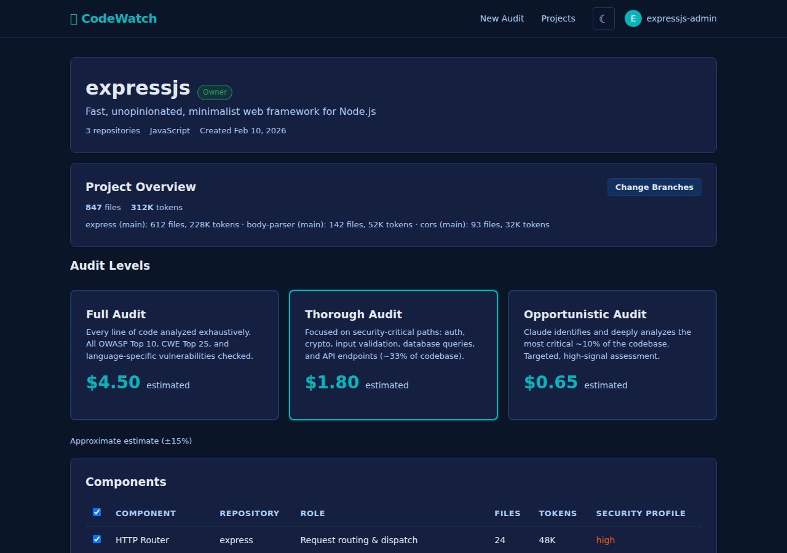

# Estimate Page

**Route:** `/estimate.html?projectId=<id>`
**Source:** `public/estimate.html`, `src/client/estimate.ts`
**Title:** "Cost Estimate - CodeWatch"

## Purpose

Configure and start a security audit with full cost transparency. The page loads project metadata and token counts, lets the user run agentic component analysis to refine scope, select an audit level, and launch the audit -- all while showing estimated USD costs at every step.



## Navigation

- **Inbound:** Home page (`/`) after project creation or selection; Projects list (`/projects.html`).
- **Outbound:** On audit start, redirects to `/audit.html?auditId=<id>`.
- **Guard:** If `projectId` query param is missing, immediately redirects to `/`.

**Related spec:** [client/estimate.md](../../spec/client/estimate.md), [services/tokens.md](../../spec/services/tokens.md), [api.md](../../spec/api.md)

---

## Sections


### 1. Project Header

**Container:** `#project-header` card with loading overlay.

| Element | Detail |
|---|---|
| Project name | `#project-name` -- derived from repo names: 1-3 repos joined with " + ", 4+ shows first 2 + "N more" |
| Description | `#project-description` -- always `GitHub org: <org>` |
| Ownership badge | `#ownership-badge` -- rendered inside the `<h1>` via `renderOwnershipBadge()` |

**Ownership badge states:**

| Condition | Badge |
|---|---|
| `ownership.isOwner === true` | `<span class="badge badge-completed">owner</span>` |
| `ownership.needsReauth === true` | `<a class="badge badge-pending">verify ownership</a>` (links to `/auth/github`) |
| Otherwise | No badge |

**Loading state:** Spinner + "Loading project..." shown until both `GET /api/projects/:id` and `POST /api/estimate` resolve in parallel.
**Error state:** If either request fails, the loading overlay is replaced with a `notice-error` div showing the error message. Page initialization stops.

### 2. Previous Audit Notice

**Container:** `#previous-audit-notice` (hidden by default).

Shown when `EstimateData.previousAudit` is present. Displays two buttons:

| Button | Effect |
|---|---|
| **Run Incremental** (`#incremental-btn`) | Sets `useIncremental = true`, highlights itself as primary, updates start button label to prefix "Start incremental". |
| **Run Fresh Audit** (`#fresh-btn`) | Sets `useIncremental = false`, highlights itself as primary. |

Selection is toggle-style (one active at a time via class swap between `btn-primary` / `btn-secondary`). A help paragraph explains the difference between modes.

When incremental is chosen and the audit is started, `baseAuditId` is sent in the `POST /api/audit/start` payload.

### 3. Clone Errors

**Container:** `#clone-errors` (hidden by default).

If `EstimateData.cloneErrors` is non-empty, a `notice-error` div lists each failed repo and its error message as `<li>` items. The page continues to function for repos that did clone successfully.

### 4. Repositories

**Container:** `#project-stats` card.

| Element | Source |
|---|---|
| Per-repo breakdown | Compact repo rows: each shows `repoName` (with external link icon to GitHub) `· N files · N tokens · branch @ sha`. Multi-repo projects show an hr + Total row with combined files and tokens. |

#### Branch Editor

Toggled by the **Change Branches** button (`#change-branches-btn`). Button text is singular ("Change Branch") for single-repo, plural ("Change Branches") for multi-repo.

**Flow:**
1. Click "Change Branches" -- button disables, editor div (`#branch-editor`) shows, spinner while loading.
2. Fetches `GET /api/github/repos/:org/:repo/branches` for every repo in parallel.
3. Renders one `<select>` per repo, pre-selecting the current branch. Default branch is annotated with `(default)`.
4. **Apply** (`#apply-branches-btn`): Calls `PUT /api/projects/:id/branches` with selected branches (sends `null` for default branch), then re-fetches project + estimate, re-renders header/stats/cards. Editor hides.
5. **Cancel** (`#cancel-branches-btn`): Hides editor, re-enables "Change Branches" button.

**Error state:** If branch-loading fails, replaces spinner with `notice-error` inside the editor area.

[GAP] No loading/disabled state on Apply button visible to user besides text change to "Applying...". If the PUT fails, the error toast fires but the editor remains open with stale data.

### 5. Audit Levels

**Container:** `#estimate-grid` -- three `.estimate-card` divs.

| Card | `data-level` | Coverage | Description |
|---|---|---|---|
| Full Audit | `full` | 100% of code | Every line analyzed exhaustively. All OWASP Top 10, CWE Top 25, language-specific checks. |
| Thorough Audit | `thorough` | ~33% | Security-critical paths: auth, crypto, input validation, DB queries, API endpoints. |
| Opportunistic Audit | `opportunistic` | ~10% | Claude identifies and deeply analyzes the most critical ~10%. Targeted, high-signal. |

Each card shows estimated cost in USD via `formatUSD()` with `<small>estimated</small>` suffix.

**States:**
- **Disabled** (class `disabled`): Cards start disabled. Clicks are ignored. Hint text reads "Run component analysis to enable selection."
- **Enabled**: After component analysis completes, `disabled` class is removed and hint is hidden.
- **Selected** (class `selected`): Exclusive -- clicking one deselects all others. Sets `aria-pressed="true"`. Reveals Step 3 (`#step-3`).

**Keyboard accessible:** `role="button"`, `tabindex="0"`. Enter and Space activate the card.

**Footer** (`#cards-footer`):
- Precision label: "Approximate estimate (+/-15%)" or "Precise estimate (token count verified)" based on `EstimateData.isPrecise`.
- **Get Precise Estimate** button (`#precise-btn`): Calls `POST /api/estimate/precise`, updates all cards with precise costs, hides itself when `isPrecise` is true. Shows "Calculating..." while in flight.

### 6. API Key Section

**Container:** `#api-key-section` card.

| Element | Detail |
|---|---|
| Input | `type="password"`, `id="api-key"`, placeholder `sk-ant-...` |
| Help text | "Used for component analysis and audits. Never stored." |
| Format error | `#api-key-error` -- hidden by default, shown when key is non-empty and does not start with `sk-ant-` |
| Inline hint | Dynamically created `#api-key-hint` div with "Anthropic API keys start with 'sk-ant-'" when prefix is wrong |

**Validation:** `isValidApiKeyFormat()` checks `key.startsWith('sk-ant-')`. This gates both the Analyze Components button and the Start Audit button.

**On input event:** Updates both `updateAnalyzeButton()` and `updateStartButton()` reactively.

[GAP] No server-side key validity check before starting analysis. An invalid key that passes prefix check will fail at the Anthropic API call. The user sees this as an analysis failure error toast.

[REC] Consider adding a lightweight key validation endpoint (e.g., `POST /api/validate-key`) that tests the key against the Anthropic API before enabling expensive operations.

### 7. Component Analysis

**Container:** `#analyze-section` card.

**Pre-analysis state** (`#component-not-analyzed`):
- Shows estimated analysis cost: calculated as ~5% of total project tokens, priced at Opus 4.5 rates ($5/Mtok input, $25/Mtok output with ~15% output ratio).
- **Analyze Components** button (`#analyze-components-btn`): Disabled until API key passes format validation.

**Analysis in-progress state** (`#component-analyzing`):
- Spinner + progress text: "Analyzing... Turn N/M (~$X.XX)".
- Polls `GET /api/projects/:id/component-analysis/:analysisId` every 2 seconds.
- Max 150 polls (~5 minutes). Times out with error toast.

**Completion:**
- On `status === 'completed'`: Fetches components via `GET /api/projects/:id/components`, transitions to Step 2.
- On `status === 'failed'`: Shows error toast with `errorMessage`, restores pre-analysis state.
- Analyze section hides; re-analyze link (`#reanalyze-section`) appears.

**Re-analyze** (`#reanalyze-btn`): Click re-shows the analyze section and hides the re-analyze link.

**Existing components shortcut:** On page load, if user is authenticated, `loadExistingComponents()` attempts to fetch previously-analyzed components. If found, skips directly to Step 2.

[GAP] No cancel/abort mechanism for in-progress component analysis. User must wait for timeout or completion.

[REC] Add a cancel button that calls a server endpoint to abort the analysis, or at minimum stops polling and resets the UI.

### 8. Component Selection (Step 2)

**Container:** `#step-2` (hidden until analysis completes).

**Table** (`#component-table`):

| Column | Source |
|---|---|
| Checkbox | `.component-checkbox` with `data-id` -- pre-checked for all components |
| Component | `name` (bold) + `description` (first 80 chars, muted) |
| Repository | `repoName` |
| Role | `role` or "--" |
| Files | `estimatedFiles` (formatted) |
| Tokens | `estimatedTokens` (formatted) |
| Security Profile | `securityProfile.summary` (first 60 chars) or "--" |

**Select-all** (`#select-all-components`): Toggles all individual checkboxes. The element is cloned on each re-render to remove accumulated listeners.

**Scoped estimate** (`#scoped-estimate-label`): On each selection change:
1. Calls `POST /api/estimate/components` with selected `componentIds` and `totalTokens`.
2. Updates all three audit level cards with scoped costs.
3. Shows summary: "N of M components selected (X files, Y tokens)".
4. If zero components selected: cards show "--", label shows "No components selected".

[GAP] No debounce on checkbox changes -- each toggle fires an API call immediately. Rapid toggling could cause race conditions in estimate display.

[REC] Debounce `onComponentSelectionChange` by ~300ms to batch rapid toggles into a single API call.

### 9. Access Tier Preview (Step 3)

**Container:** `#access-tier-preview` and `#non-owner-notice` (both hidden by default, inside `#step-3`).

Shown after project data loads. Logic:

| Condition | Display |
|---|---|
| `ownership.isOwner` | `notice-info`: "**Full access** -- you'll see complete findings as the project owner." |
| `ownership.needsReauth` | `notice-info`: "**Ownership unverified** -- re-authenticate with GitHub to verify org ownership and get full access." (with link) |
| User logged in but not owner | `notice-warn` (`#non-owner-notice`): Explains redaction policy -- medium+ findings are redacted (severity, CWE, repo, and status visible; all other fields null), time-gated (3mo medium/high, 6mo critical). Also shows `notice-info`: "**Redacted access** -- medium and above findings will be partially redacted." |
| User not logged in | Nothing shown |

[GAP] Access tier preview is rendered on page load but placed inside `#step-3` which is hidden until a level is selected. The ownership badge in the header is the only early indicator. Users may not see the access tier warning until they've already invested time in component analysis.

### 10. Start Audit (Step 3)

**Container:** `#step-3` -- revealed when an audit level is selected.

**Button** (`#start-audit-btn`):

**Disabled conditions** (all must be satisfied to enable):
1. Valid API key (starts with `sk-ant-`)
2. Audit level selected
3. At least one component selected

**Dynamic label** based on state:

| State | Label |
|---|---|
| No components selected | "Select at least one component above" |
| No level selected | "Select an audit level above" |
| No API key | "Enter your API key above" |
| Invalid key format | "Invalid key format (should start with sk-ant-)" |
| Ready | "Start [incremental] <level> audit [(<N> components)] (~$X.XX)" |

Component count suffix only appears when a subset of components is selected (not all).

**On click:**
1. Button disables, text changes to "Starting audit...".
2. Sends `POST /api/audit/start` with: `projectId`, `level`, `apiKey`, optionally `baseAuditId` (if incremental), optionally `componentIds` (if subset selected).
3. On success: redirects to `/audit.html?auditId=<id>`.
4. On failure: re-enables button, restores dynamic label, shows error toast.

---

## Data Flow

```
Page Load
  |
  +-- GET /api/projects/:id --------+
  +-- POST /api/estimate -----------+-- parallel
  |                                 |
  v                                 v
  renderProjectHeader()         renderProjectStats()
  renderOwnershipBadge()        renderEstimateCards()
  accessTierPreview()           updatePrecisionLabel()
                                updateAnalysisCostHint()
  |
  +-- GET /api/projects/:id/components  (if authenticated)
  |     |
  |     +-- components found? --> showStep2() --> enableCards()
  |
  [User enters API key]
  |
  +-- POST /api/projects/:id/analyze-components
  |     |
  |     +-- poll GET .../component-analysis/:id  (every 2s, max 150)
  |     |     |
  |     |     +-- completed --> GET .../components --> showStep2()
  |     |     +-- failed --> error toast, reset UI
  |     |     +-- timeout --> error toast, reset UI
  |
  [User selects components]
  |
  +-- POST /api/estimate/components  (on each selection change)
  |
  [User selects level] --> show step-3
  |
  [User clicks Start]
  |
  +-- POST /api/audit/start --> redirect /audit.html?auditId=<id>
```

## API Endpoints Used

| Method | Endpoint | Purpose |
|---|---|---|
| GET | `/api/projects/:id` | Load project metadata, repos, ownership |
| POST | `/api/estimate` | Initial rough estimate (files, tokens, costs) |
| POST | `/api/estimate/precise` | Precise token-verified estimate |
| POST | `/api/estimate/components` | Scoped estimate for selected components |
| GET | `/api/projects/:id/components` | Load existing component analysis results |
| POST | `/api/projects/:id/analyze-components` | Start agentic component analysis |
| GET | `/api/projects/:id/component-analysis/:analysisId` | Poll analysis progress |
| GET | `/api/github/repos/:org/:repo/branches` | List branches for branch editor |
| PUT | `/api/projects/:id/branches` | Update selected branches per repo |
| POST | `/api/audit/start` | Launch the audit |

## Key Interfaces

```typescript
EstimateData {
  totalFiles, totalTokens,
  repoBreakdown: [{ repoName, files, tokens, headSha?, branch? }],
  estimates: { full, thorough, opportunistic } (each: { files, tokens, costUsd }),
  previousAudit?: { id, createdAt, level, maxSeverity },
  isPrecise: boolean,
  cloneErrors?: [{ repoName, error }]
}

ProjectData {
  id, name, description, githubOrg, category, createdBy,
  ownership: { isOwner, role, needsReauth } | null,
  repos: [{ id, repoName, language, stars, defaultBranch, branch }]
}

ComponentItem {
  id, name, description, role, repoName,
  filePatterns, languages,
  securityProfile: { summary?, threat_surface? } | null,
  estimatedFiles, estimatedTokens
}

AnalysisStatus {
  id, status, turnsUsed, maxTurns, costUsd, errorMessage
}
```

## Edge Cases

- **No projectId in URL:** Immediate redirect to `/`.
- **Auth not completed:** `waitForAuth()` awaited before any user-dependent logic.
- **Clone errors with partial success:** Error notice shown for failed repos; page continues with available data.
- **Zero components from analysis:** Step 2 is not shown (the `comps.length > 0` guard); analyze section remains hidden. No feedback to user.
- **All components deselected:** Card prices show "--", start button shows "Select at least one component above" and is disabled.
- **Rapid branch changes:** Apply button disables and shows "Applying..." during flight, but "Change Branches" button is only re-enabled on cancel, not on apply success (it stays disabled until editor is hidden).

## Gaps and Recommendations Summary

| ID | Type | Description |
|---|---|---|
| GAP-1 | Missing feedback | No cancel mechanism for in-progress component analysis |
| GAP-2 | Race condition | No debounce on component checkbox changes; rapid toggling fires concurrent API calls |
| GAP-3 | Validation gap | No server-side API key validation before expensive analysis; prefix-only client check |
| GAP-4 | UX ordering | Access tier preview hidden inside Step 3; users discover access limitations late |
| GAP-5 | Empty result | Zero components from analysis produces no user-visible feedback |
| REC-1 | Improvement | Add cancel button / abort endpoint for component analysis |
| REC-2 | Improvement | Debounce `onComponentSelectionChange` by ~300ms |
| REC-3 | Improvement | Add lightweight `POST /api/validate-key` endpoint before enabling analysis |
| REC-4 | Improvement | Surface access tier preview earlier (e.g., below project header) so non-owners understand limitations before investing time |
| REC-5 | Improvement | Show explicit "No components found" message when analysis returns zero results |
