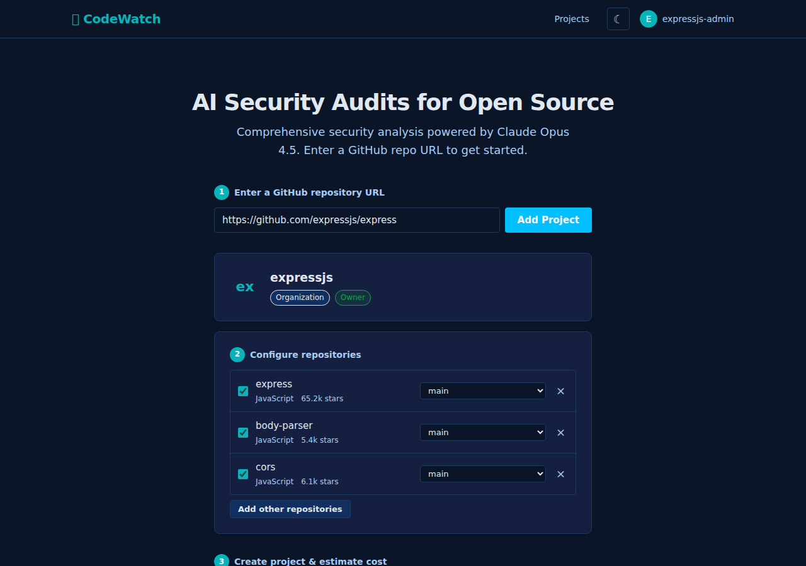

# Home Page

## Purpose

Three-step wizard that guides the user from a GitHub URL to creating a new CodeWatch project. This is the primary entry point for new users.

## Route

`GET /` or `GET /index.html`

## Navigation Context

- **Entry**: Landing page for new and returning users.
- **Exit**: On successful project creation, redirects to `/estimate.html?projectId={id}`.
- **Header nav**: Logo (links to `/`), "Projects" link, theme toggle, auth status (sign in / avatar + logout).

---

## Step 1: Enter GitHub URL



### What the User Sees

- **Hero**: Heading "AI Security Audits for Open Source", subtext about Claude Opus 4.5.
- **Step indicator**: Badge "1" with label "Enter a GitHub repository URL".
- **Input row**: URL text input (placeholder `https://github.com/org/repo`) + "Add Project" button.
- **Error line**: Hidden by default; shown below the input in red on validation failure.

### User Interaction

1. User types or pastes a GitHub URL into the input field.
2. Clicks "Add Project" (or presses Enter -- keydown listener on the input triggers button click).
3. **Client-side validation**: URL is parsed via `new URL()`. Must have `hostname === 'github.com'` and at least two path segments (`/owner/repo`). Trailing slashes and `.git` suffix are stripped.
4. **On invalid URL**: Error text "Enter a valid GitHub URL (e.g. https://github.com/org/repo)" is shown.
5. **On valid URL**: Button changes to "Loading...", disabled. Two parallel API calls fire:
   - `GET /api/github/entity/{owner}` -- returns entity info (login, type, avatar, ownership)
   - `GET /api/github/orgs/{owner}/repos` -- returns full repo list for the owner
6. **On API success**: Steps 2 and 3 are revealed. The entered repo is pre-selected.
7. **On API error**: Error message from the API (or "Failed to fetch project info") is shown inline.
8. Button restores to "Add Project" (enabled) in the `finally` block regardless of outcome.

### Accepted URL Formats

| Input URL                              | Parsed owner | Parsed repo |
|----------------------------------------|--------------|-------------|
| `https://github.com/org/repo`          | `org`        | `repo`      |
| `https://github.com/user/repo.git`     | `user`       | `repo`      |
| `https://github.com/org/repo/`         | `org`        | `repo`      |
| `https://github.com/org/repo/tree/...` | `org`        | `repo`      |

[GAP] The parser requires exactly `github.com` as the hostname. URLs with `www.github.com` or other GitHub Enterprise domains are rejected without a specific error message explaining why.

[REC] Either accept `www.github.com` as a valid alias, or provide a more specific error message when the hostname is close but not exact.

[GAP] The URL parser requires at least two path segments (`/owner/repo`). Entering an org-only URL like `https://github.com/org` is rejected, even though the hero text says "Enter a GitHub repo URL" and the API supports fetching entity info by owner alone.

[REC] Either support owner-only URLs (fetch all repos for the owner) or clarify in the placeholder/label that a specific repo URL is required.

---

## Step 2: Configure Repositories


### What the User Sees

**Entity card** (top of step 2):
- Avatar image (from GitHub)
- Entity name (login)
- Type badge: "User" or "Organization"
- Ownership badge (exactly one shown based on server response):
  - `Owner` badge (green) -- when `isOwner === true`
  - `Member` badge -- when `role === 'member'`
  - `Verify ownership` link badge -- when `needsReauth === true`; links to `/auth/github`
  - No badge -- when none of the above conditions are met

**Selected repos list** (below entity card):
- Step indicator: Badge "2" with label "Configure repositories"
- Each selected repo shows:
  - Remove button (x) on the left
  - Repo name
  - Metadata line: language, star count
  - Branch selector button on the right (shows current branch name) -- **only shown for authenticated users** (the branch API requires authentication)

**Branch selector** (authenticated users only):
1. Click the branch button to open a `<select>` dropdown.
2. Dropdown first shows "Loading..." while fetching `GET /api/github/repos/{owner}/{repo}/branches`.
3. Branches are cached per repo in `branchCache` (Map) -- subsequent opens use the cache.
4. Default branch is marked with `(default)` suffix in the dropdown.
5. Selecting a branch updates the repo config. If the selected branch equals the default branch, `branch` is set to `null` (meaning "use default").
6. Dropdown closes on selection or on blur (with a 150ms delay to allow click registration).
7. On fetch error, the dropdown is removed and the trigger button is restored.

**"Add other repositories" section**:
- Toggle button: "Add other repositories" / "Hide other repositories"
- When expanded:
  - Header row with "Select all" checkbox and a "Filter repositories..." text input
  - List of all repos **not** currently selected
  - Each repo row: checkbox, name, language, star count, description (truncated to 80 chars)
  - Clicking anywhere on the row toggles the checkbox
  - Checking a repo adds it to `selectedRepos` with its default branch
  - Unchecking removes it
  - "Select all" toggles all visible checkboxes
  - Filter input searches against repo name and metadata text (case-insensitive substring match)
  - If all repos are already selected: "All repositories are selected" message

[GAP] The "Select all" checkbox does not account for the search filter. It toggles all checkboxes in the list, including those hidden by the filter. This could surprise users who expect "select all" to apply only to visible/filtered results.

[REC] Make "Select all" only toggle currently visible (non-hidden) repo checkboxes.

~~[GAP] After adding repos from the "other repositories" list, the list is not re-rendered.~~ (RESOLVED)

**Fixed:** `renderAllReposList()` is now called after every checkbox change and after removing a repo via the remove button, keeping both lists in sync.

---

## Step 3: Create Project


### What the User Sees

- Step indicator: Badge "3" with label "Create project & estimate cost"
- **If not signed in**: Info notice "Sign in with GitHub to continue." with a "Sign in" link to `/auth/github`. The create button is disabled.
- **If signed in**: Notice is hidden. Button is enabled (if repos are selected).
- **Button text**: "Create Project (N repos)" where N is the count, or "Select at least one repository" if none selected.

### Authentication Check

- `updateStep3()` calls `waitForAuth()` which polls every 50ms until the global `checkAuth()` promise from `common.ts` resolves.
- `checkAuth()` calls `GET /auth/me`. On success, `currentUser` is populated. On failure, `currentUser` is null.
- The button is disabled when `!hasSelection || !isLoggedIn`.

### Create Flow

1. User clicks "Create Project (N repos)".
2. Button is disabled; loading overlay ("Setting up project...") with spinner is shown; step 3 is hidden.
3. `POST /api/projects` is called with body:
   ```json
   {
     "githubOrg": "<owner>",
     "repos": [
       { "name": "<repo>", "branch": "<branch-or-undefined>", "defaultBranch": "<default>" }
     ]
   }
   ```
4. **On success**: `window.location.href = /estimate.html?projectId={id}`.
5. **On error**: Loading overlay hidden, step 3 restored, button re-enabled, `showError()` prepends a red notice to `<main>`.

[GAP] The loading overlay has no timeout or cancel mechanism. If the API call hangs, the user is stuck on a spinner with no way to retry.

[REC] Add a timeout (e.g., the default 60s from `apiFetch`) and ensure the error handler restores the UI. Consider adding a "Cancel" button on the loading overlay.

[GAP] No client-side duplicate-project handling. The server returns 409 for exact duplicates (same user, same org, same sorted repo set), but the client shows a generic error instead of redirecting to the existing project.

[REC] On 409 response, extract the existing project ID from the response body and redirect to it, or show a link to the existing project.

---

## Loading & Error States

| State                        | Trigger                              | UI Change                                                        |
|------------------------------|--------------------------------------|------------------------------------------------------------------|
| URL validation error         | Invalid GitHub URL format            | Red text below input: "Enter a valid GitHub URL..."              |
| API fetch error (step 1)     | Entity/repos API failure             | Red text below input with error message from API                 |
| Rate limited                 | API returns 429                      | Special message: "Rate limited. Please wait N seconds..."        |
| Auth not signed in           | `currentUser` is null                | Info notice with "Sign in" link; create button disabled          |
| Project creation loading     | Create button clicked                | Spinner overlay "Setting up project..."; step 3 hidden           |
| Project creation error       | POST /api/projects fails             | Overlay hidden; red notice prepended to main                     |
| Branch fetch error           | Branch API call fails                | Dropdown silently removed; trigger button restored               |

[GAP] Branch fetch errors are silently swallowed (catch block just restores UI). The user gets no feedback about why the dropdown disappeared.

[REC] Show a brief inline error or tooltip when branch fetching fails so the user knows to retry.

**Related spec:** [client/home.md](../../spec/client/home.md), [api.md](../../spec/api.md), [services/github.md](../../spec/services/github.md)

---

## Source Files

- `/code/codewatch/public/index.html` -- page markup and structure
- `/code/codewatch/src/client/home.ts` -- all wizard logic (URL parsing, API calls, rendering, state)
- `/code/codewatch/src/client/common.ts` -- shared utilities (`apiFetch`, `apiPost`, `showError`, auth, DOM helpers)
