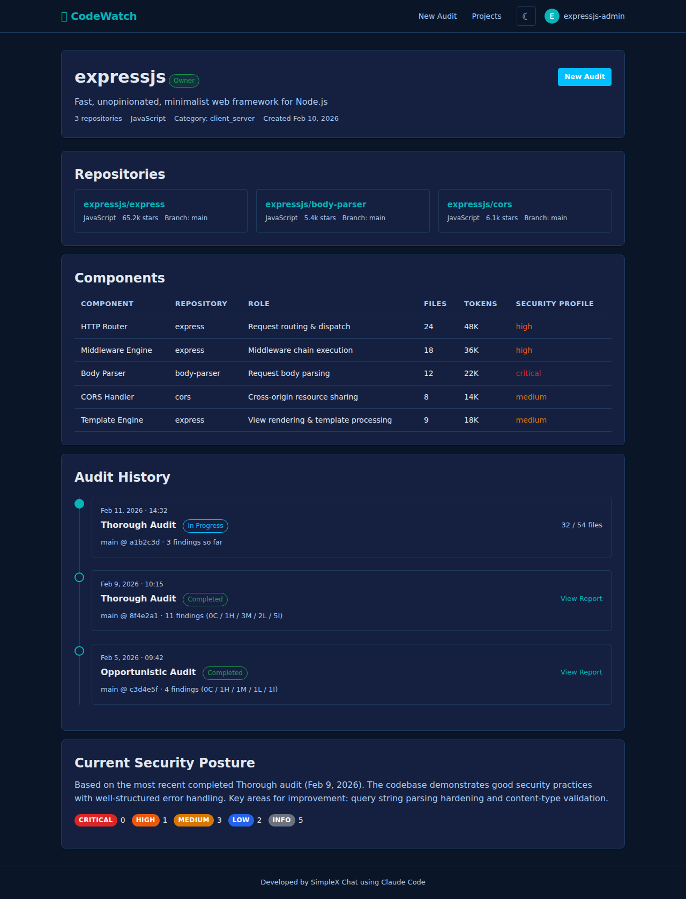

# Project Dashboard

## Purpose

Central hub for a single project. Displays all metadata, repositories, components, dependencies, audit history, and current security posture. Serves as the entry point for starting new audits and viewing past reports.

## Route

`GET /project.html?projectId=<uuid>`

Redirects to `/` if `projectId` query parameter is missing.

## Data Source

`GET /api/projects/:id` returns a `ProjectDetail` object containing project metadata, repos, components, dependencies, and audits in a single response. Auth is resolved optionally -- unauthenticated users see the project if it has public audits; authenticated users additionally see their own projects.

## Sections

### 1. Project Info

Top card, always visible. Shows a loading spinner while the API call is in flight.

- **Project name** (`<h1>`, inline) and **ownership badge** (inline ``):
  - `owner` badge (green) when the current user is a verified GitHub org owner.
  - `re-auth needed` link (yellow, links to `/auth/github?returnTo=...`) when the user has a stale token and is not yet verified as owner (`renderOwnershipBadge` from common.ts handles this logic).
  - No badge for anonymous visitors or non-members.
- **"New Audit" button** (top-right): links to `/estimate.html?projectId=<id>`.
- **Description**: project description, or fallback `"GitHub org: <org>"` when description is empty.
- **Metadata row** (`.audit-meta`): Org name, license (if set), repo count, file count (formatted with `formatNumber`), token count (formatted).

### 2. Classification & Threat Model

Hidden by default; shown only when `project.category` is set.

- **Category**: displayed as bold text with underscores replaced by spaces.
- **Threat model source badge**:
  - `"From Repository"` (green `badge-completed`) when `threatModelSource === 'repo'`.
  - `"Generated by CodeWatch"` (blue `badge-running`) when `threatModelSource === 'generated'`.
- **Involved parties table** (when `involvedParties` has entries):
  - Columns: Party, Can, Cannot.
  - Each party name has underscores replaced by spaces.
  - `can`/`cannot` values are joined with `; ` when arrays, or displayed as-is when strings, or `'-'` when absent.
- **Fallback**: if `involvedParties` is empty but `threatModel` text exists, shows the source badge plus raw threat model text in a `<pre>` code block (truncated to 2000 chars).

[GAP] Threat model text is truncated to 2000 characters client-side with no indication to the user that content was cut off.

[REC] Add a "Show full threat model" toggle or truncation indicator so users know content was trimmed.

### 3. Repositories

Always visible. Shows a spinner while loading.

Each repository is rendered as a card containing:
- **Repo name**: linked to GitHub URL (`target="_blank" rel="noopener"`) when `repoUrl` is present, plain text otherwise.
- **Language** (if set): dot-separated, muted text.
- **License** (if set): dot-separated, muted text.
- **Stars**: right-aligned, locale-formatted number.
- **Description** (if set): muted text below the header row.

### 4. Components

Hidden by default; shown only when `components.length > 0`.

Table (`.findings-table`) with columns:

| Column | Content |
|--------|---------|
| Component | Name (bold) + description (first 80 chars, muted small text) |
| Repository | `repoName` |
| Role | Component role, or `'--'` |
| Files | `estimatedFiles`, formatted |
| Tokens | `estimatedTokens`, formatted |
| Security Profile | `securityProfile.summary` (first 60 chars), or `'--'` |

[GAP] Component descriptions and security profiles are truncated without indication. The `filePatterns`, `languages`, and `threat_surface` fields from the API response are fetched but not displayed.

[REC] Consider adding expandable rows or tooltips to show full descriptions and the omitted fields.

### 5. Dependencies

Hidden by default; shown only when `dependencies.length > 0`.

Dependencies are grouped by `ecosystem` (fallback: `'other'`). Each ecosystem gets an `<h4>` heading followed by a `<ul>` list. Each dependency shows:

- **Name** and **version** (muted text).
- **Action** (one of, by priority):
  1. `"View Project"` button: links to `/project.html?projectId=<linkedProjectId>` when the dependency is already linked to a CodeWatch project.
  2. `"Add as Project"` button: shown to authenticated users for unlinked dependencies. Uses `attachAddAsProjectHandlers()` from `common.ts` to create a new project from the dependency's source repo URL via API.
  3. `"source"` link: external link to `sourceRepoUrl` for anonymous users when URL is available.
  4. Nothing: when none of the above apply.

[GAP] The "Add as Project" flow does not provide feedback about what happens after clicking -- the user must navigate to the newly created project manually.

[REC] After successful "Add as Project", replace the button with a "View Project" link pointing to the newly created project.

### 6. Audit History

Always visible. The API returns the **last 10 audits** only. Shows an empty state ("No audits yet / Run the first security audit for this project.") when `audits.length === 0`.

Rendered as a vertical **timeline** (`.timeline`) with connected dots:

Each timeline item contains:
- **Date**: formatted via `formatDate()`.
- **Audit level** (bold): e.g., "full", "thorough", "opportunistic".
- **Incremental badge** (`badge-running`): shown only when `audit.isIncremental === true`.
- **Status badge**: colored by status -- `badge-completed` (green), `badge-failed` (red), or `badge-running` (blue) for in-progress.
- **Public badge** (`badge-completed`): shown when `audit.isPublic === true`.
- **Severity summary**: ordered `critical > high > medium > low > informational`, each with count and severity-colored badge. Only severities with `count > 0` are shown.
- **"View" link** (right-aligned button):
  - `completed` status: links to `/report.html?auditId=<id>`.
  - `failed` status: links to `#` (no-op).
  - Other statuses (running/pending): links to `/audit.html?auditId=<id>` (progress page).
  - [GAP] `completed_with_warnings` audits are not handled explicitly — they fall into "Other statuses" and link to the progress page instead of the report page.

The first (most recent) item gets an additional `.latest` CSS class.

### 7. Current Security Posture

Hidden by default; shown only when at least one audit has `status === 'completed'`.

Based on the **first completed audit** found in the array (audits are ordered newest-first by the API):

- **Summary text**: "Based on <level> audit from <date>".
- **Severity counts**: each severity level displayed as a labeled count (`severity-count` divs).

[GAP] The posture section uses the first completed audit found in the array, relying on the API returning audits in reverse chronological order. If the API order changes, the wrong audit would be shown.

[REC] Explicitly sort audits by `completedAt` descending client-side, or have the API return a dedicated `latestCompletedAudit` field.

### 8. Delete Project

Hidden by default; shown only when `currentUser.id === project.createdBy`.

- **"Delete Project" button**: red text, small style.
- **Confirmation**: browser `confirm()` dialog: "Are you sure you want to delete this project? This cannot be undone."
- **API call**: `DELETE /api/projects/:id`.
- **Success**: redirects to `/projects.html`.
- **Error**: displays error via `showError()`.

Server-side guards:
- Only the project creator or a verified GitHub org owner can delete.
- Deletion is **blocked** (HTTP 409) if other users have audits on the project (`foreignAudits` check).
- Cascade deletes in a transaction: audit comments, findings, commits, audit components, audits, dependencies, components, component analyses, repos, then the project itself.

[GAP] The client only checks `currentUser.id === project.createdBy` to show the delete button, but the server also allows verified org owners to delete. Org owners who are not the creator will never see the delete button even though the API would allow it.

[REC] Show the delete button when `project.ownership.isOwner === true` in addition to the creator check.

[GAP] There is no client-side indication of why deletion might fail (e.g., foreign audits exist). The error message from the API is shown generically.

[REC] Pre-check for foreign audits and show a disabled button with tooltip explaining the restriction.

## Navigation

- **Inbound**: from projects list (`/projects.html`), from report page, from estimate page, from dependency "View Project" links on other project pages.
- **Outbound**: "New Audit" -> `/estimate.html?projectId=<id>`, "View" audit -> `/report.html` or `/audit.html`, repo links -> GitHub (external), dependency "View Project" -> another project page.
- **After delete**: redirects to `/projects.html`.

## Error Handling

- If the API call fails, the loading spinner is replaced with a red error notice showing the error message.
- Delete failures show an error via `showError()`.

**Related spec:** [client/project.md](../../spec/client/project.md), [api.md](../../spec/api.md), [services/ownership.md](../../spec/services/ownership.md)

## Source Files

- `/code/codewatch/public/project.html` -- HTML template
- `/code/codewatch/src/client/project.ts` -- client-side rendering logic
- `/code/codewatch/src/client/common.ts` -- shared helpers (`renderOwnershipBadge`, `attachAddAsProjectHandlers`, `severityClass`, `formatNumber`, `formatDate`)
- `/code/codewatch/src/server/routes/api.ts` -- `GET /api/projects/:id`, `DELETE /api/projects/:id`
