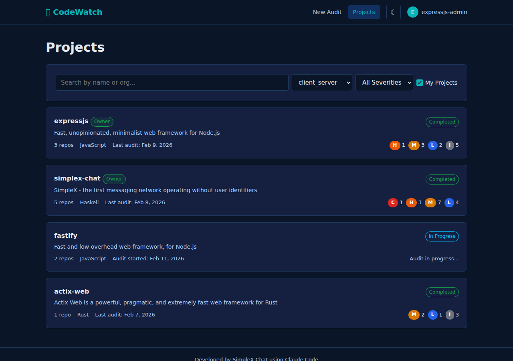

# Projects Browser

## Purpose

Browse all public projects with filters, or view the current user's own projects. Serves as the main discovery page for finding audited open-source projects on CodeWatch.

## Route

`GET /projects.html` (static file, no query parameters required)

## Data Source

`GET /api/projects/browse?search=&category=&severity=&mine=` returns a `BrowseResponse` containing:
- `projects`: array of `BrowseProject` objects.
- `filters.categories`: distinct category values from the visible project set.
- `filters.severities`: distinct `max_severity` values from completed audits, sorted by severity order (critical first).

Auth is resolved optionally via session cookie. The endpoint works without authentication.

## Visibility Rules

| User State | Visible Projects |
|------------|-----------------|
| Anonymous (no session) | Only projects that have at least one public audit (`is_public = TRUE`) |
| Logged in | Projects with at least one public audit **OR** projects created by the current user |
| Logged in + "My Projects" checked | Subset of visible projects where `created_by = currentUser.id` |

The "My Projects" toggle is a **subset filter** applied on top of the base visibility, not a separate query path. It further restricts results to projects the user created.

Ownership badges are resolved per unique GitHub org (deduplicated to minimize GitHub API calls) for authenticated users.

## Page Layout

### Header

Standard nav bar with "New Audit" and "Projects" links, theme toggle, and auth status.

### Filters

A card containing a row of filter controls (flex-wrapped):

#### 1. Search Input

- Text input, placeholder: `"Search by name or org..."`.
- **Debounced** at 300ms: typing triggers `loadProjects()` after 300ms of inactivity.
- Searches against `project.name` and `project.github_org` using case-insensitive `ILIKE` matching on the server.

#### 2. Category Filter

- `<select>` dropdown, default option: `"All Categories"`.
- **Populated dynamically** on first successful API response from `filters.categories`.
- Category names have underscores replaced by spaces for display.
- Changing the selection immediately triggers `loadProjects()`.

#### 3. Severity Filter

- `<select>` dropdown, default option: `"All Severities"`.
- **Populated dynamically** on first successful API response from `filters.severities`.
- Severity names are capitalized for display (e.g., `"critical"` -> `"Critical"`).
- Filters to projects that have at least one completed audit with `max_severity` matching the selected value.
- Changing the selection immediately triggers `loadProjects()`.

#### 4. "My Projects" Checkbox

- **Hidden by default**; shown only after `waitForAuth()` resolves and `currentUser` is non-null.
- Label element gets a `.filter-active` CSS class toggle when checked (visual indicator).
- Changing the checkbox immediately triggers `loadProjects()`.
- Server returns HTTP 401 if `mine=true` is sent without authentication.

[GAP] Filter dropdowns are populated only on the first successful load and not refreshed when filters change. If the user applies a category filter that reduces the visible set, the severity dropdown still shows all severities from the unfiltered base set (and vice versa). This is by design (filter values come from the base set without category/severity/search applied) but could confuse users who expect cross-filtering.

[REC] Consider adding counts next to filter options (e.g., "Critical (3)") so users can see how many projects match before selecting.

### Project Cards

Each project is rendered as a clickable card (`<a>` tag wrapping the entire card) linking to `/project.html?projectId=<id>`. Cards contain:

**Top row** (flex-between):
- **Left**: Project name (bold) + org name (dot-separated, muted).
- **Right**: Ownership badge (if resolved) + latest severity badge (colored by severity class).

**Bottom row** (`.audit-meta`):
- Category (underscores replaced by spaces, if set).
- License (if set).
- Audit count: shows `publicAuditCount` in normal mode, or `auditCount` (all audits) in "My Projects" mode. Label changes accordingly (`"public audit"` vs `"audit"`).
- Latest audit date (formatted, if available).

[GAP] The audit count label switches between "public audits" and "audits" based on the "My Projects" toggle state, but this is a client-side presentation choice. The `isMineMode` parameter is passed to `renderProjectCard` to control this, meaning the same project card looks different depending on the filter state rather than the data itself.

[REC] Consider always showing both counts (e.g., "3 audits (2 public)") to avoid confusion.

### Empty State

Shown when `response.projects.length === 0`. Card is hidden; empty state div is shown with:
- Heading: `"No projects found"`.
- Message depends on mode:
  - "My Projects" checked: `"You have no projects yet. Add a project from the home page."`.
  - Normal mode: `"No projects match your filters."`.

### Loading State

While the API call is in flight, the project list area shows a spinner with "Loading..." text. The empty state is hidden during loading.

## Pagination

[GAP] The API query has `LIMIT 50` but there is no pagination UI. Users with more than 50 visible projects cannot access projects beyond the first page.

[REC] Add pagination controls (next/previous or infinite scroll) and pass `offset` to the API. Alternatively, show a notice when 50 results are returned indicating more may exist.

## Error Handling

- API errors replace the project list with a red error notice showing the error message.
- The empty state is not shown on error (only the error notice).

## Navigation

- **Inbound**: from nav bar "Projects" link (available on all pages), redirect after project deletion.
- **Outbound**: clicking any project card navigates to `/project.html?projectId=<id>`.

## Source Files

- `/code/codewatch/public/projects.html` -- HTML template
- `/code/codewatch/src/client/projects.ts` -- client-side filtering and rendering logic
- `/code/codewatch/src/client/common.ts` -- shared helpers (`renderOwnershipBadge`, `severityClass`, `formatDate`, `waitForAuth`)
- `/code/codewatch/src/server/routes/api.ts` -- `GET /api/projects/browse` endpoint (lines 282-412)
