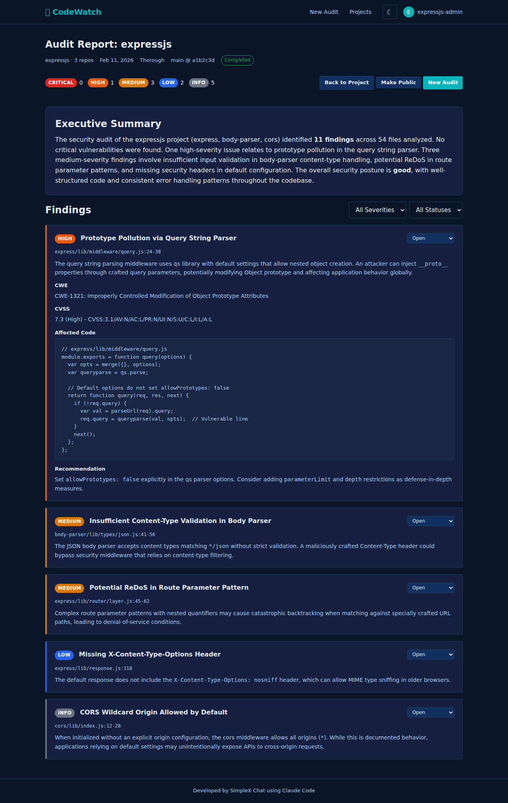

# Report View

**Purpose:** Display a comprehensive security audit report with three-tier access control, allowing owners to manage findings and publication, requesters to trigger responsible disclosure, and the public to see summary information.

**Route:** `/report.html?auditId={auditId}`

**Screenshots:**
- 
-  *(redacted view uses the same layout with redacted content)*

**Source files:**
- `public/report.html`
- `src/client/report.ts`

---

## Navigation Context

- **Comes from:** Audit progress page ("View Report" button on completion)
- **Links to:**
  - Project page (`/project.html?projectId={projectId}`) via "Back to Project" and project name link in header
  - Estimate page (`/estimate.html?projectId={projectId}`) via "New Audit" button (owner only)
  - Linked dependency project pages via "View Project" buttons in Dependencies section

---

## Access Tiers (Critical Concept)

The `accessTier` field (`'owner' | 'requester' | 'public'`) controls what content is visible and what actions are available. An access tier badge is rendered in the report header via `renderAccessTierBadge()`.

### Tier 1: Owner

- **Visibility:** Full report -- all findings with complete detail (title, description, file path, code snippet, exploitation, recommendation)
- **Actions:**
  - Publish report (make public) / Unpublish (make private again)
  - Change finding status: open, fixed, false_positive, accepted, wont_fix
  - "Back to Project" and "New Audit" buttons
  - Post comments

### Tier 2: Requester

- **Visibility:** Redacted report -- low/informational findings are visible in full. Medium, high, and critical findings show severity badge only; title, description, file path, code snippet, exploitation, and recommendation are redacted. A `redactionNotice` warning banner explains the redaction.
- **Redaction detection:** A finding is considered redacted when both `title` and `description` are falsy. Redacted findings display "[Redacted]" as title and "Finding details redacted during responsible disclosure period." as body text.
- **`redactedSeverities`:** Array indicating which severity levels are redacted in the response.
- **Actions:**
  - "Notify Owner" button (creates GitHub issue, starts responsible disclosure timer)
  - Post comments
- **Conditions:** "Notify Owner" button shown only when `isRequester && !isOwner && !ownerNotified`

### Tier 3: Public

- **Visibility:** Summary only -- severity counts and max severity are shown. Individual findings list may be empty or limited by the API. The report sections (executive summary, security posture, etc.) render based on whatever the API returns.
- **Actions:** Read-only. No controls shown. Comment section is visible but comment form is hidden (no `currentUser`).

---

## Page Sections

### 1. Report Header

| Element | ID | Content |
|---|---|---|
| Title | `report-title` | "Audit Report: {projectName}" |
| Project link | `report-project` | Links to `/project.html?projectId={projectId}` |
| Date | `report-date` | `completedAt` (falls back to `createdAt`), formatted via `formatDate()` |
| Level | `report-level` | Audit level text + " (incremental)" suffix if applicable |
| Commit SHAs | `report-commit` | `repoName@abc1234` in monospace, one per repo |
| Access tier badge | `access-tier-badge` | Colored badge via `renderAccessTierBadge(accessTier)` |

A "Back to Project" link (Issue #28) is rendered either from the existing element or dynamically prepended to the header.

### 2. Severity Summary

Ordered colored badges with counts for each severity level present in the report:

**Order:** critical, high, medium, low, informational

Only severities with count > 0 are shown. Each rendered as:
```
<span class="severity {severityClass}">{severity}</span> {count}
```

### 3. Owner Controls (Tier 1 only)

- **"Back to Project"** button -- links to project page
- **"Make Public"** button (`publish-btn`) -- calls `POST /api/audit/{auditId}/publish`, reloads page. Requires confirmation dialog.
- **"Make Private"** button (`unpublish-btn`) -- shown instead of publish when `isPublic` is true. Calls `POST /api/audit/{auditId}/unpublish`, reloads page. Requires confirmation dialog.
- **"New Audit"** button -- links to `/estimate.html?projectId={projectId}`

### 4. Requester Controls (Tier 2 only)

- **"Notify Owner"** button (`notify-owner-btn`) -- shown when `isRequester && !isOwner && !ownerNotified`
  - Confirmation dialog: "Notify the project owner about this audit via a GitHub issue? This starts the responsible disclosure timer."
  - Calls `POST /api/audit/{auditId}/notify-owner`
  - Response includes `publishableAfter` date
  - Page reloads after notification

### 5. Notification Status

Blue info notice shown when `ownerNotified && publishableAfter`:
> "Owner notified on {date}. Full report will be available after {publishableAfter}."

### 6. Executive Summary

AI-generated text from `reportSummary.executive_summary`. Falls back to "No summary available." if `reportSummary` is null.

### 7. Security Posture

AI-generated text from `reportSummary.security_posture`. Section hidden if `reportSummary` is null.

### 8. Classification

Shown when `category` is present:
- **Category badge:** `badge-running` styled, underscores replaced with spaces
- **Description:** `projectDescription` text below the badge (if present)

### 9. Threat Model

Shown when `involvedParties` has entries or `threatModel` text exists.

**Source badge:** Indicates origin of the threat model:
- `repo` -- "From Repository" (`badge-completed` style)
- `generated` -- "Generated by CodeWatch" (`badge-running` style)

**Involved Parties table** (when `involvedParties` has entries):

| Party | Can | Cannot |
|---|---|---|
| Party name (underscores replaced with spaces) | Semicolon-joined list of capabilities | Semicolon-joined list of restrictions |

**Threat model text:** Shown below the table as muted text (if present).

**Fallback:** If only `threatModel` text exists (no parties), rendered as a `<pre>` code block, truncated to 2000 characters.

### 10. Component Breakdown

Table shown when `componentBreakdown` array is non-empty:

| Component | Role | Findings | Tokens Analyzed |
|---|---|---|---|
| Component name (bold) | Role description or "--" | Finding count | Formatted number |

### 11. Dependencies

Shown when `dependencies` array is non-empty. Grouped by `ecosystem` (fallback: "other").

Each dependency shows:
- Name + version (muted)
- **If linked:** "View Project" button linking to `/project.html?projectId={linkedProjectId}`
- **If logged in and not linked:** "Add as Project" button (calls `attachAddAsProjectHandlers()` shared helper)
- **If not logged in but has source URL:** "source" link to `sourceRepoUrl`

### 12. Redacted Notice

Yellow warning banner shown when `redactionNotice` is present (Tier 2 access). Displays the server-provided redaction explanation text.

### 13. Findings

#### Filter Controls

Shown when findings array is non-empty. Two dropdowns:

- **Severity filter** (`severity-filter`): "All Severities" + only severities present in findings
- **Status filter** (`status-filter`): "All Statuses" + only statuses present in findings
- **Filter count badge** (Issue #70): Dynamically created badge showing "{N} active" when filters are applied

Filters apply client-side to the in-memory findings array; no API call needed.

#### Finding Cards

Each finding renders as a `.finding-card` with severity-based border class (`.finding-{severity}`):

- **Header row:**
  - Title (or "[Redacted]" for redacted findings)
  - Status badge: `badge-pending` (open), `badge-completed` (fixed), `badge-running` (other)
  - Severity badge with `severityClass()` color
- **Location line** (when `filePath` present):
  - `{repoName}/{filePath}:{lineStart}[-{lineEnd}]`
  - CWE ID (e.g., "CWE-79")
  - CVSS score (e.g., "CVSS 7.5")
- **Body:**
  - Description paragraph (or redaction notice for Tier 2)
  - Exploitation section (h4 + paragraph, if present)
  - Recommendation section (h4 + paragraph, if present)
  - Code snippet (h4 + `<pre>` block, if present)
- **Owner actions** (Tier 1 only):
  - Status dropdown: open, fixed, false_positive, accepted, wont_fix
  - On change: `PATCH /api/findings/{findingId}/status` with `{ status: value }`
  - Badge updates immediately on success; reverts to previous value on API error
  - In-memory `reportData.findings` array is also updated on success for filter consistency

### 14. Comments

Always visible (section shown for all tiers). Comment form visible only when `currentUser && (isOwner || isRequester)`.

- **Load:** `GET /api/audit/{auditId}/comments` returns `Comment[]`
- **Display:** Each comment shows username, formatted datetime, and content. "No comments yet." when empty.
- **Submit:** `POST /api/audit/{auditId}/comments` with `{ content: string }`. Clears input and reloads comments on success.
- **Error handling:** Load errors silently ignored (non-critical). Submit errors shown via `showError()`.

### 15. Responsible Disclosure

Shown when `reportSummary.responsible_disclosure` has entries. Renders each key-value pair as:
> **{key}:** {value}

---

## Data Model

```typescript
interface Finding {
  id: string;
  severity: string;         // critical | high | medium | low | informational
  cweId: string;
  cvssScore: number;
  title: string;            // empty string when redacted
  description: string;      // empty string when redacted
  exploitation: string;     // empty string when redacted
  recommendation: string;   // empty string when redacted
  codeSnippet: string;      // empty string when redacted
  filePath: string;         // empty string when redacted
  lineStart: number;
  lineEnd: number;
  repoName: string;
  status: string;           // open | fixed | false_positive | accepted | wont_fix
}

interface ReportData {
  id: string;
  projectId: string;
  projectName: string;
  auditLevel: string;
  isIncremental: boolean;
  isOwner: boolean;
  isRequester: boolean;
  isPublic: boolean;
  publishableAfter: string | null;
  ownerNotified: boolean;
  ownerNotifiedAt: string | null;
  maxSeverity: string | null;
  category: string | null;
  projectDescription: string | null;
  involvedParties: Record<string, { can: string | string[]; cannot: string | string[] }> | null;
  threatModel: string | null;
  threatModelSource: string | null;   // 'repo' | 'generated'
  commits: Array<{ repoName: string; commitSha: string }>;
  reportSummary: {
    executive_summary: string;
    security_posture: string;
    responsible_disclosure: Record<string, string>;
  } | null;
  severityCounts: Record<string, number>;
  findings: Finding[];
  redactedSeverities: string[];
  redactionNotice: string | null;
  componentBreakdown: Array<{
    componentId: string;
    name: string;
    role: string;
    tokensAnalyzed: number;
    findingsCount: number;
  }>;
  dependencies: Array<{
    id: string;
    name: string;
    version: string;
    ecosystem: string;
    sourceRepoUrl: string | null;
    linkedProjectId: string | null;
    repoName: string | null;
  }>;
  accessTier: 'owner' | 'requester' | 'public';
  createdAt: string;
  completedAt: string;
}

interface Comment {
  id: string;
  userId: string;
  username: string;
  content: string;
  findingId: string | null;    // supports per-finding comments (not yet used in UI)
  createdAt: string;
}
```

---

## API Endpoints Used

| Method | Endpoint | Purpose | Used by |
|---|---|---|---|
| GET | `/api/audit/{auditId}/report` | Fetch full report data | Page load |
| PATCH | `/api/findings/{findingId}/status` | Update finding status | Owner finding dropdown |
| GET | `/api/audit/{auditId}/comments` | Load comments | Page load + after submit |
| POST | `/api/audit/{auditId}/comments` | Post new comment | Comment form |
| POST | `/api/audit/{auditId}/publish` | Make report public | Owner publish button |
| POST | `/api/audit/{auditId}/unpublish` | Make report private | Owner unpublish button |
| POST | `/api/audit/{auditId}/notify-owner` | Notify owner, start disclosure timer | Requester notify button |

---

## Gaps and Recommendations

- [GAP] The `findingId` field exists on `Comment` but the UI has no mechanism to attach comments to specific findings. All comments are audit-level.
- [REC] Add per-finding comment threads -- a "Comment" button on each finding card that opens a scoped comment input.

- [GAP] No pagination or lazy loading for findings. Large audits with many findings render all cards at once.
- [REC] Implement virtual scrolling or "Show more" pagination for findings lists exceeding ~50 items.

- [GAP] The threat model text is truncated to 2000 characters in the fallback (no parties) rendering path, with no indication to the user that content was cut off.
- [REC] Add a "Show full threat model" expand/collapse control, or remove the truncation.

- [GAP] The "Notify Owner" success message uses `showError()` (red toast) for what is actually a success confirmation.
- [REC] Use a success-styled notification (green) or a dedicated `showSuccess()` helper.

- [GAP] Publish/unpublish and notify-owner actions reload the entire page on success. This loses scroll position and feels jarring.
- [REC] Update the in-memory state and re-render affected sections without a full page reload.

- [GAP] No export/download capability. Users cannot save the report as PDF or share a static snapshot.
- [REC] Add "Export as PDF" or "Print" button that triggers browser print or server-side PDF generation.

- [GAP] The public tier (Tier 3) behavior is defined by whatever the API returns, but the client has no explicit handling for the `public` access tier -- it falls through the same rendering logic.
- [REC] Add explicit public tier UI: show a clear "Public Summary View" banner and suppress sections that would be empty, to avoid rendering empty cards.

- [GAP] No loading state for finding status changes. The dropdown updates optimistically but there is no spinner or disabled state during the API call.
- [REC] Disable the dropdown and show a brief loading indicator while the PATCH request is in flight.

- [GAP] The `isIncremental` flag is shown in the header but there is no explanation or diff view showing what changed from the previous audit.
- [REC] For incremental audits, add a "Changes from previous audit" section highlighting new, resolved, and unchanged findings.

- [GAP] Auth is awaited (`waitForAuth()`) before fetching the report, but there is no timeout or fallback if auth check hangs.
- [REC] Add a timeout to `waitForAuth()` and fall back to public-tier access if auth cannot be determined.

- [GAP] The dependencies "Add as Project" button has no feedback after clicking -- the shared handler behavior is defined in `common.ts` but the report page does not show confirmation inline.
- [REC] Show inline success/error feedback after the "Add as Project" action completes.
