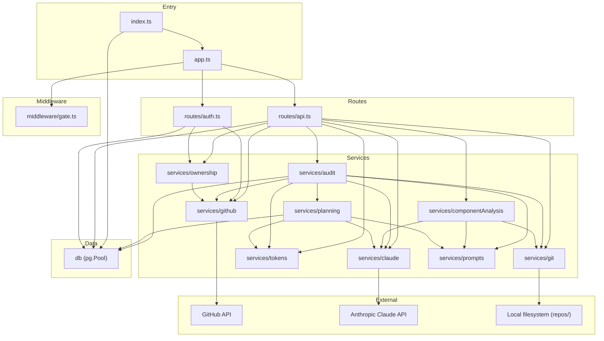

# Architecture

> Verified against commit `51a1dc8`

## Overview

CodeWatch is an AI-powered security audit platform for open-source projects.

- **Server:** Express.js (v5) on Node.js with TypeScript (CommonJS output)
- **Client:** Vanilla TypeScript compiled to JS (global scope, no module imports), served as static files (no framework, no bundler)
- **Database:** PostgreSQL 18 with sequential SQL migrations applied at startup
- **External services:** GitHub API (REST + GraphQL), Anthropic Claude API (Messages + `count_tokens`)
- **Local filesystem:** Repos cloned to `repos/` directory for git operations and file scanning

## Layers

### Server

```
index.ts
  -> initPool(), runMigrations()
  -> createApp()
       -> express.json(), cookieParser()
       -> express.static(public/)
       -> POST /gate  (gateHandler)
       -> gateMiddleware
       -> GET /api/health
       -> /auth  (routes/auth.ts)
       -> /api   (routes/api.ts)
  -> app.listen(PORT)
```

- **Entry point** (`index.ts`): Initialises the database pool, runs migrations, creates the Express app, and starts listening.
- **App factory** (`app.ts`): Assembles middleware (JSON body parser, cookie parser, static files, gate) and mounts route modules.
- **Routes** (`routes/api.ts`, `routes/auth.ts`): Map HTTP endpoints to service calls. `api.ts` handles all `/api/*` endpoints; `auth.ts` handles GitHub OAuth flow under `/auth/*`.
- **Services** (`services/*.ts`): Stateless business-logic modules consumed by routes. Each service owns one domain concern.
- **Database** (`db.ts`): Exposes a singleton `pg.Pool` and a `runMigrations()` function that applies `sql/*.sql` files in order.
- **Middleware** (`middleware/gate.ts`): Pre-launch password gate protecting non-static routes.

### Client

```
src/client/*.ts
  -> tsc (tsconfig.client.json)
  -> public/js/*.js  (global scope scripts)
  -> <script src="/js/*.js"> in HTML pages
```

Each page has its own TypeScript entry point. `common.ts` provides shared utilities (API helpers, DOM helpers, formatting). No bundler, no framework -- all scripts share a single global scope via plain `<script>` tags.

### Database

```
sql/001_*.sql -> sql/002_*.sql -> ...
```

Sequential numbered SQL migration files. Applied by `runMigrations()` at startup, tracked in a `migrations` table. Raw SQL via the `pg` driver -- no ORM.

### Prompt Templates

```
prompts/*.md -> loadPrompt() -> renderPrompt(template, vars)
```

Markdown files loaded from disk at runtime by `services/prompts.ts`. Template variables substituted with `renderPrompt()`.

## Key Architectural Decisions

| # | Decision | Rationale |
|---|----------|-----------|
| 1 | **No ORM** -- raw SQL via `pg` driver | Direct control, audit-grade query visibility, no magic |
| 2 | **No client bundler** -- TypeScript compiled to ES modules | Simplicity, no build complexity, browser-native module loading |
| 3 | **BYOK (Bring Your Own Key)** -- user provides Anthropic API key | No billing infrastructure needed; users control their own spend |
| 4 | **Async audit execution** -- fire-and-forget with polling | Audits take minutes; avoids WebSocket complexity |
| 5 | **File-based prompt templates** -- markdown files on disk | Easy to edit, version-controlled alongside code |
| 6 | **GitHub OAuth for identity** -- no custom auth system | Target users are OSS developers; GitHub is the natural identity provider |
| 7 | **Three-tier report access** -- owner / requester / public | Supports responsible disclosure workflow |
| 8 | **Local git clones** -- repos cloned to filesystem | Full git operations (diff, log, blame), file content scanning |

## Dependency Graph



## Deployment

### Docker Compose

Two services defined in `docker-compose.yml`:

| Service | Image | Purpose |
|---------|-------|---------|
| `db` | `postgres:18` | PostgreSQL database |
| `app` | Built from `Dockerfile` | Node.js application (node:24-alpine + git + curl) |

### Startup Sequence

1. `db` starts and runs `docker/init-db.sql` via entrypoint
2. `db` healthcheck passes (`pg_isready`)
3. `app` starts: `node dist/server/migrate.js && node dist/server/index.js`
4. Migrations applied, server listens on port 3000

### Volumes

| Host Path | Container Path | Purpose |
|-----------|---------------|---------|
| `./repos` | `/app/repos` | Git clone storage |
| `./db` | `/var/lib/postgresql` | PostgreSQL data persistence |

### Environment Variables

All configuration via environment variables. See [config.md](config.md) for the full reference.

Key variables: `DATABASE_URL`, `GITHUB_CLIENT_ID`, `GITHUB_CLIENT_SECRET`, `GITHUB_CALLBACK_URL`, `ANTHROPIC_SERVICE_KEY`, `COOKIE_SECRET`, `REPOS_DIR`, `PORT`.
