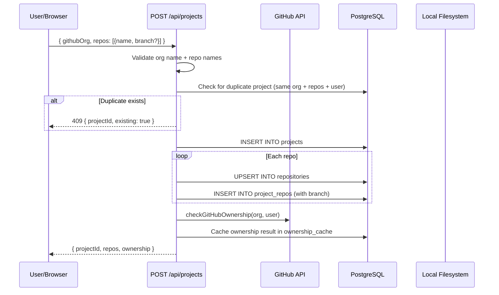
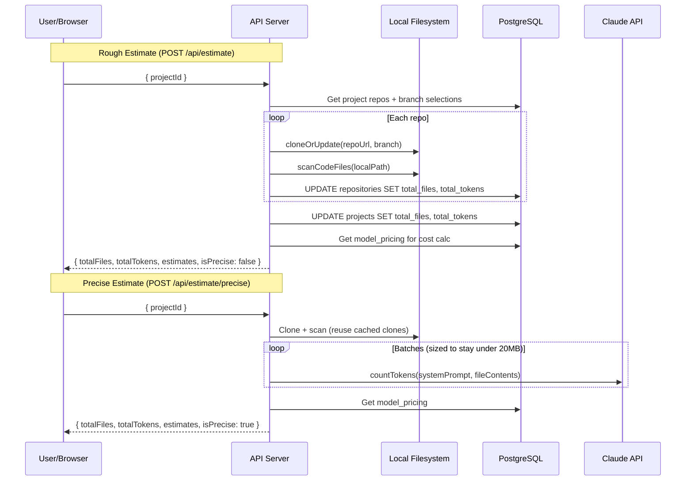
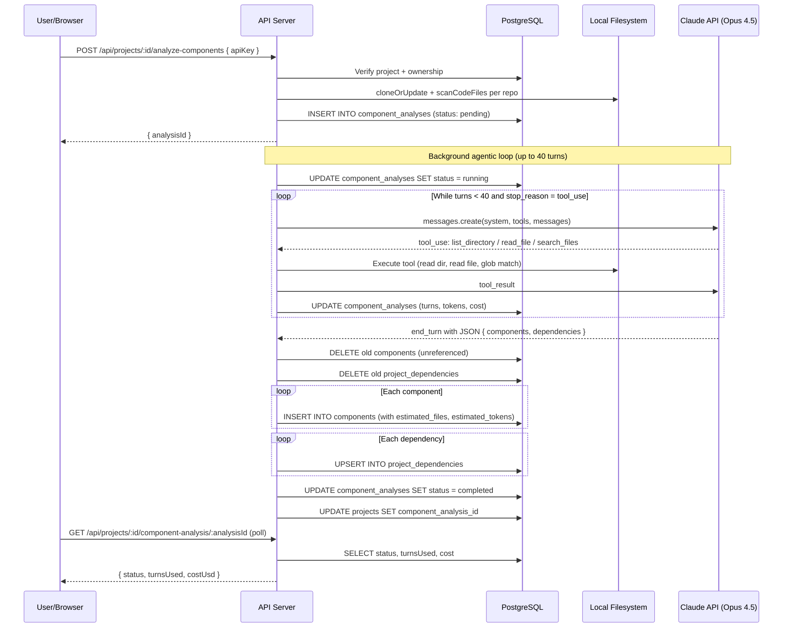
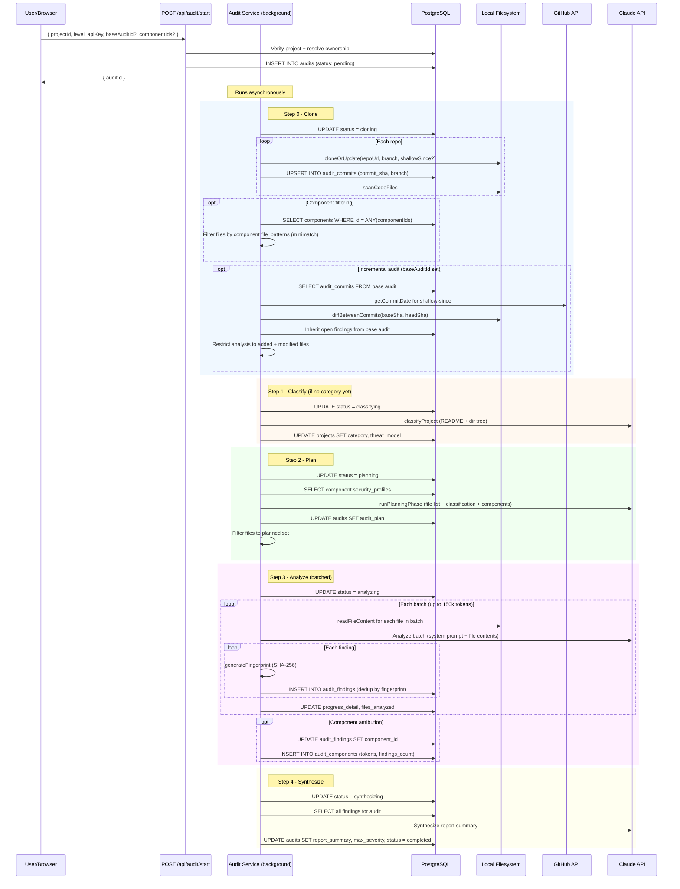
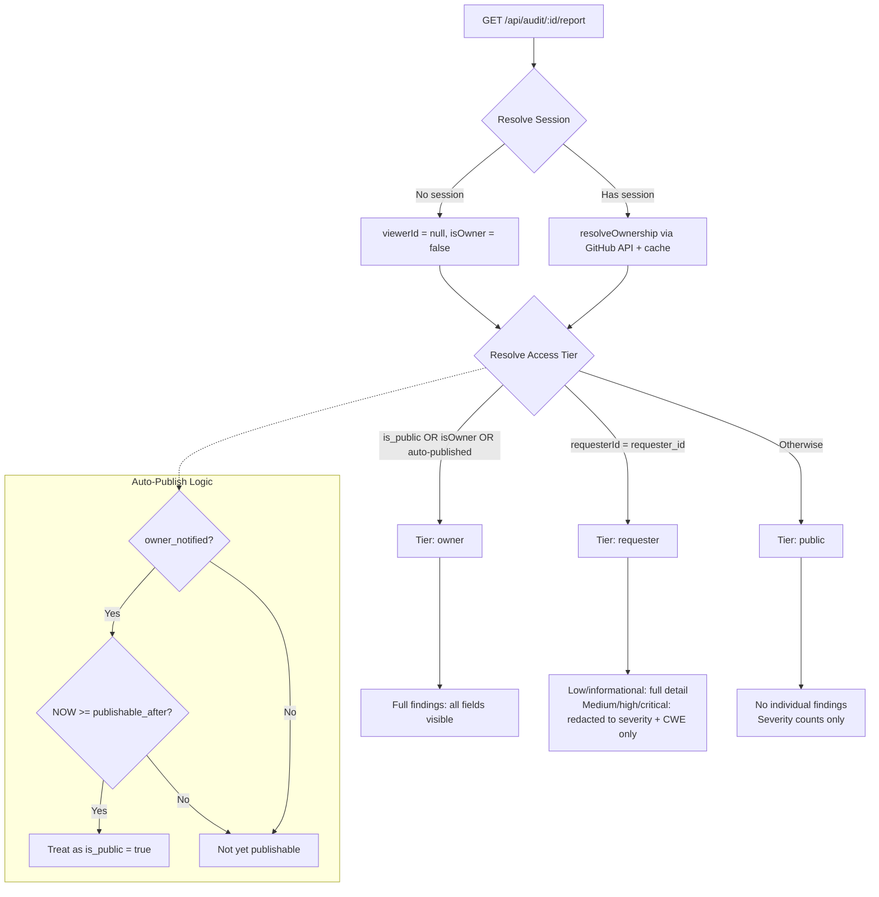

# Data Flow Diagrams

## 1. Project Creation

```mermaid
sequenceDiagram
    participant U as User/Browser
    participant API as POST /api/projects
    participant GH as GitHub API
    participant DB as PostgreSQL
    participant FS as Local Filesystem

    U->>API: { githubOrg, repos: [{name, branch?}] }
    API->>API: Validate org name + repo names
    API->>DB: Check for duplicate project (same org + repos + user)
    alt Duplicate exists
        API-->>U: 409 { projectId, existing: true }
    end
    API->>DB: INSERT INTO projects
    loop Each repo
        API->>DB: UPSERT INTO repositories
        API->>DB: INSERT INTO project_repos (with branch)
    end
    API->>GH: checkGitHubOwnership(org, user)
    API->>DB: Cache ownership result in ownership_cache
    API-->>U: { projectId, repos, ownership }
```

## 2. Cost Estimation

```mermaid
sequenceDiagram
    participant U as User/Browser
    participant API as API Server
    participant FS as Local Filesystem
    participant DB as PostgreSQL
    participant Claude as Claude API

    Note over U,API: Rough Estimate (POST /api/estimate)
    U->>API: { projectId }
    API->>DB: Get project repos + branch selections
    loop Each repo
        API->>FS: cloneOrUpdate(repoUrl, branch)
        API->>FS: scanCodeFiles(localPath)
        API->>DB: UPDATE repositories SET total_files, total_tokens
    end
    API->>DB: UPDATE projects SET total_files, total_tokens
    API->>DB: Get model_pricing for cost calc
    API-->>U: { totalFiles, totalTokens, estimates, isPrecise: false }

    Note over U,API: Precise Estimate (POST /api/estimate/precise)
    U->>API: { projectId }
    API->>FS: Clone + scan (reuse cached clones)
    loop Batches (sized to stay under 20MB)
        API->>Claude: countTokens(systemPrompt, fileContents)
    end
    API->>DB: Get model_pricing
    API-->>U: { totalFiles, totalTokens, estimates, isPrecise: true }
```

## 3. Component Analysis (Agentic)

```mermaid
sequenceDiagram
    participant U as User/Browser
    participant API as API Server
    participant DB as PostgreSQL
    participant FS as Local Filesystem
    participant Claude as Claude API (Opus 4.5)

    U->>API: POST /api/projects/:id/analyze-components { apiKey }
    API->>DB: Verify project + ownership
    API->>FS: cloneOrUpdate + scanCodeFiles per repo
    API->>DB: INSERT INTO component_analyses (status: pending)
    API-->>U: { analysisId }

    Note over API,Claude: Background agentic loop (up to 40 turns)
    API->>DB: UPDATE component_analyses SET status = running
    loop While turns < 40 and stop_reason = tool_use
        API->>Claude: messages.create(system, tools, messages)
        Claude-->>API: tool_use: list_directory / read_file / search_files
        API->>FS: Execute tool (read dir, read file, glob match)
        API->>Claude: tool_result
        API->>DB: UPDATE component_analyses (turns, tokens, cost)
    end
    Claude-->>API: end_turn with JSON { components, dependencies }
    API->>DB: DELETE old components (unreferenced)
    API->>DB: DELETE old project_dependencies
    loop Each component
        API->>DB: INSERT INTO components (with estimated_files, estimated_tokens)
    end
    loop Each dependency
        API->>DB: UPSERT INTO project_dependencies
    end
    API->>DB: UPDATE component_analyses SET status = completed
    API->>DB: UPDATE projects SET component_analysis_id

    U->>API: GET /api/projects/:id/component-analysis/:analysisId (poll)
    API->>DB: SELECT status, turnsUsed, cost
    API-->>U: { status, turnsUsed, costUsd }
```

## 4. Audit Execution

```mermaid
sequenceDiagram
    participant U as User/Browser
    participant API as POST /api/audit/start
    participant Audit as Audit Service (background)
    participant DB as PostgreSQL
    participant FS as Local Filesystem
    participant GH as GitHub API
    participant Claude as Claude API

    U->>API: { projectId, level, apiKey, baseAuditId?, componentIds? }
    API->>DB: Verify project + resolve ownership
    API->>DB: INSERT INTO audits (status: pending)
    API-->>U: { auditId }

    Note over Audit: Runs asynchronously

    rect rgb(240,248,255)
        Note right of Audit: Step 0 - Clone
        Audit->>DB: UPDATE status = cloning
        loop Each repo
            Audit->>FS: cloneOrUpdate(repoUrl, branch, shallowSince?)
            Audit->>DB: UPSERT INTO audit_commits (commit_sha, branch)
            Audit->>FS: scanCodeFiles
        end
        opt Component filtering
            Audit->>DB: SELECT components WHERE id = ANY(componentIds)
            Audit->>Audit: Filter files by component file_patterns (minimatch)
        end
        opt Incremental audit (baseAuditId set)
            Audit->>DB: SELECT audit_commits FROM base audit
            Audit->>GH: getCommitDate for shallow-since
            Audit->>FS: diffBetweenCommits(baseSha, headSha)
            Audit->>DB: Inherit open findings from base audit
            Audit->>Audit: Restrict analysis to added + modified files
        end
    end

    rect rgb(255,248,240)
        Note right of Audit: Step 1 - Classify (if no category yet)
        Audit->>DB: UPDATE status = classifying
        Audit->>Claude: classifyProject (README + dir tree)
        Audit->>DB: UPDATE projects SET category, threat_model
    end

    rect rgb(240,255,240)
        Note right of Audit: Step 2 - Plan
        Audit->>DB: UPDATE status = planning
        Audit->>DB: SELECT component security_profiles
        Audit->>Claude: runPlanningPhase (file list + classification + components)
        Audit->>DB: UPDATE audits SET audit_plan
        Audit->>Audit: Filter files to planned set
    end

    rect rgb(255,240,255)
        Note right of Audit: Step 3 - Analyze (batched)
        Audit->>DB: UPDATE status = analyzing
        loop Each batch (up to 150k tokens)
            Audit->>FS: readFileContent for each file in batch
            Audit->>Claude: Analyze batch (system prompt + file contents)
            loop Each finding
                Audit->>Audit: generateFingerprint (SHA-256)
                Audit->>DB: INSERT INTO audit_findings (dedup by fingerprint)
            end
            Audit->>DB: UPDATE progress_detail, files_analyzed
        end
        opt Component attribution
            Audit->>DB: UPDATE audit_findings SET component_id
            Audit->>DB: INSERT INTO audit_components (tokens, findings_count)
        end
    end

    rect rgb(255,255,240)
        Note right of Audit: Step 4 - Synthesize
        Audit->>DB: UPDATE status = synthesizing
        Audit->>DB: SELECT all findings for audit
        Audit->>Claude: Synthesize report summary
        Audit->>DB: UPDATE audits SET report_summary, max_severity, status = completed
    end
```

## 5. Report Access (Three-Tier Access Control)

```mermaid
flowchart TD
    A[GET /api/audit/:id/report] --> B{Resolve Session}
    B -->|No session| C[viewerId = null, isOwner = false]
    B -->|Has session| D[resolveOwnership via GitHub API + cache]

    C --> E{Resolve Access Tier}
    D --> E

    E -->|is_public OR isOwner OR auto-published| F["Tier: owner"]
    E -->|requesterId = requester_id| G["Tier: requester"]
    E -->|Otherwise| H["Tier: public"]

    F --> I[Full findings: all fields visible]
    G --> J["Low/informational: full detail\nMedium/high/critical: redacted to severity + CWE only"]
    H --> K["No individual findings\nSeverity counts only"]

    subgraph Auto-Publish Logic
        L{owner_notified?} -->|Yes| M{NOW >= publishable_after?}
        M -->|Yes| N[Treat as is_public = true]
        M -->|No| O[Not yet publishable]
        L -->|No| O
    end

    E -.-> L
```
