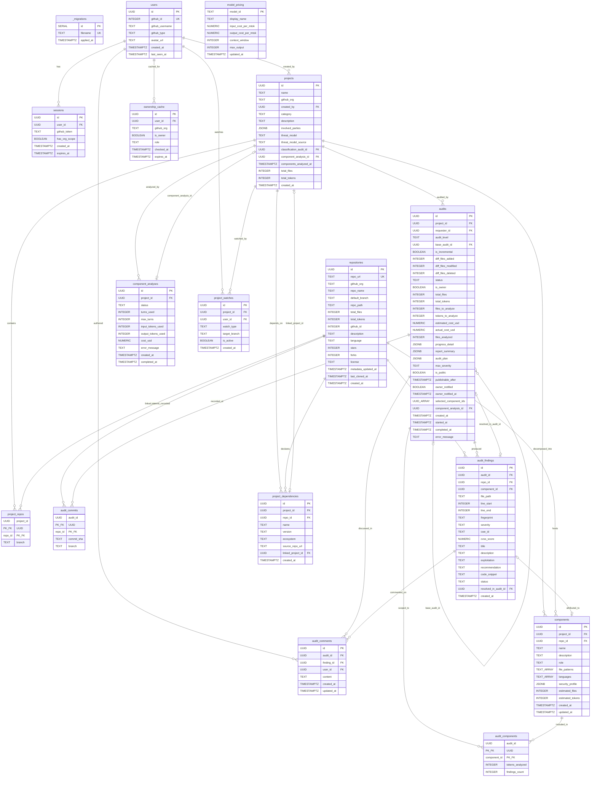

# Entity-Relationship Diagram

Full database schema derived from SQL migrations 001-004 and db.ts.

```mermaid
erDiagram
    _migrations {
        SERIAL id PK
        TEXT filename UK
        TIMESTAMPTZ applied_at
    }

    users {
        UUID id PK
        INTEGER github_id UK
        TEXT github_username
        TEXT github_type
        TEXT avatar_url
        TIMESTAMPTZ created_at
        TIMESTAMPTZ last_seen_at
    }

    sessions {
        UUID id PK
        UUID user_id FK
        TEXT github_token
        BOOLEAN has_org_scope
        TIMESTAMPTZ created_at
        TIMESTAMPTZ expires_at
    }

    projects {
        UUID id PK
        TEXT name
        TEXT github_org
        UUID created_by FK
        TEXT category
        TEXT description
        JSONB involved_parties
        TEXT threat_model
        TEXT threat_model_source
        UUID classification_audit_id FK
        UUID component_analysis_id FK
        TIMESTAMPTZ components_analyzed_at
        INTEGER total_files
        INTEGER total_tokens
        TIMESTAMPTZ created_at
    }

    repositories {
        UUID id PK
        TEXT repo_url UK
        TEXT github_org
        TEXT repo_name
        TEXT default_branch
        TEXT repo_path
        INTEGER total_files
        INTEGER total_tokens
        INTEGER github_id
        TEXT description
        TEXT language
        INTEGER stars
        INTEGER forks
        TEXT license
        TIMESTAMPTZ metadata_updated_at
        TIMESTAMPTZ last_cloned_at
        TIMESTAMPTZ created_at
    }

    project_repos {
        UUID project_id PK_FK
        UUID repo_id PK_FK
        TEXT branch
    }

    audits {
        UUID id PK
        UUID project_id FK
        UUID requester_id FK
        TEXT audit_level
        UUID base_audit_id FK
        BOOLEAN is_incremental
        INTEGER diff_files_added
        INTEGER diff_files_modified
        INTEGER diff_files_deleted
        TEXT status
        BOOLEAN is_owner
        INTEGER total_files
        INTEGER total_tokens
        INTEGER files_to_analyze
        INTEGER tokens_to_analyze
        NUMERIC estimated_cost_usd
        NUMERIC actual_cost_usd
        INTEGER files_analyzed
        JSONB progress_detail
        JSONB report_summary
        JSONB audit_plan
        TEXT max_severity
        BOOLEAN is_public
        TIMESTAMPTZ publishable_after
        BOOLEAN owner_notified
        TIMESTAMPTZ owner_notified_at
        UUID_ARRAY selected_component_ids
        UUID component_analysis_id FK
        TIMESTAMPTZ created_at
        TIMESTAMPTZ started_at
        TIMESTAMPTZ completed_at
        TEXT error_message
    }

    audit_commits {
        UUID audit_id PK_FK
        UUID repo_id PK_FK
        TEXT commit_sha
        TEXT branch
    }

    audit_findings {
        UUID id PK
        UUID audit_id FK
        UUID repo_id FK
        UUID component_id FK
        TEXT file_path
        INTEGER line_start
        INTEGER line_end
        TEXT fingerprint
        TEXT severity
        TEXT cwe_id
        NUMERIC cvss_score
        TEXT title
        TEXT description
        TEXT exploitation
        TEXT recommendation
        TEXT code_snippet
        TEXT status
        UUID resolved_in_audit_id FK
        TIMESTAMPTZ created_at
    }

    audit_comments {
        UUID id PK
        UUID audit_id FK
        UUID finding_id FK
        UUID user_id FK
        TEXT content
        TIMESTAMPTZ created_at
        TIMESTAMPTZ updated_at
    }

    components {
        UUID id PK
        UUID project_id FK
        UUID repo_id FK
        TEXT name
        TEXT description
        TEXT role
        TEXT_ARRAY file_patterns
        TEXT_ARRAY languages
        JSONB security_profile
        INTEGER estimated_files
        INTEGER estimated_tokens
        TIMESTAMPTZ created_at
        TIMESTAMPTZ updated_at
    }

    component_analyses {
        UUID id PK
        UUID project_id FK
        TEXT status
        INTEGER turns_used
        INTEGER max_turns
        INTEGER input_tokens_used
        INTEGER output_tokens_used
        NUMERIC cost_usd
        TEXT error_message
        TIMESTAMPTZ created_at
        TIMESTAMPTZ completed_at
    }

    audit_components {
        UUID audit_id PK_FK
        UUID component_id PK_FK
        INTEGER tokens_analyzed
        INTEGER findings_count
    }

    project_dependencies {
        UUID id PK
        UUID project_id FK
        UUID repo_id FK
        TEXT name
        TEXT version
        TEXT ecosystem
        TEXT source_repo_url
        UUID linked_project_id FK
        TIMESTAMPTZ created_at
    }

    ownership_cache {
        UUID id PK
        UUID user_id FK
        TEXT github_org
        BOOLEAN is_owner
        TEXT role
        TIMESTAMPTZ checked_at
        TIMESTAMPTZ expires_at
    }

    project_watches {
        UUID id PK
        UUID project_id FK
        UUID user_id FK
        TEXT watch_type
        TEXT target_branch
        BOOLEAN is_active
        TIMESTAMPTZ created_at
    }

    model_pricing {
        TEXT model_id PK
        TEXT display_name
        NUMERIC input_cost_per_mtok
        NUMERIC output_cost_per_mtok
        INTEGER context_window
        INTEGER max_output
        TIMESTAMPTZ updated_at
    }

    users ||--o{ sessions : "has"
    users ||--o{ projects : "created_by"
    users ||--o{ audit_comments : "authored"
    users ||--o{ ownership_cache : "cached_for"
    users ||--o{ project_watches : "watches"

    projects ||--o{ project_repos : "contains"
    projects ||--o{ audits : "audited_by"
    projects ||--o{ components : "decomposed_into"
    projects ||--o{ component_analyses : "analyzed_by"
    projects ||--o{ project_dependencies : "depends_on"
    projects ||--o{ project_watches : "watched_by"
    projects |o--o| component_analyses : "component_analysis_id"

    repositories ||--o{ project_repos : "linked_via"
    repositories ||--o{ audit_commits : "commit_recorded"
    repositories ||--o{ audit_findings : "finding_in"
    repositories ||--o{ components : "hosts"
    repositories ||--o{ project_dependencies : "declares"

    audits ||--o{ audit_commits : "recorded_at"
    audits ||--o{ audit_findings : "produced"
    audits ||--o{ audit_comments : "discussed_in"
    audits ||--o{ audit_components : "scoped_to"
    audits |o--o{ audits : "base_audit_id"

    audit_findings |o--o| components : "attributed_to"
    audit_findings ||--o{ audit_comments : "commented_on"
    audit_findings |o--o| audits : "resolved_in_audit_id"

    components ||--o{ audit_components : "included_in"

    project_dependencies |o--o| projects : "linked_project_id"
```
