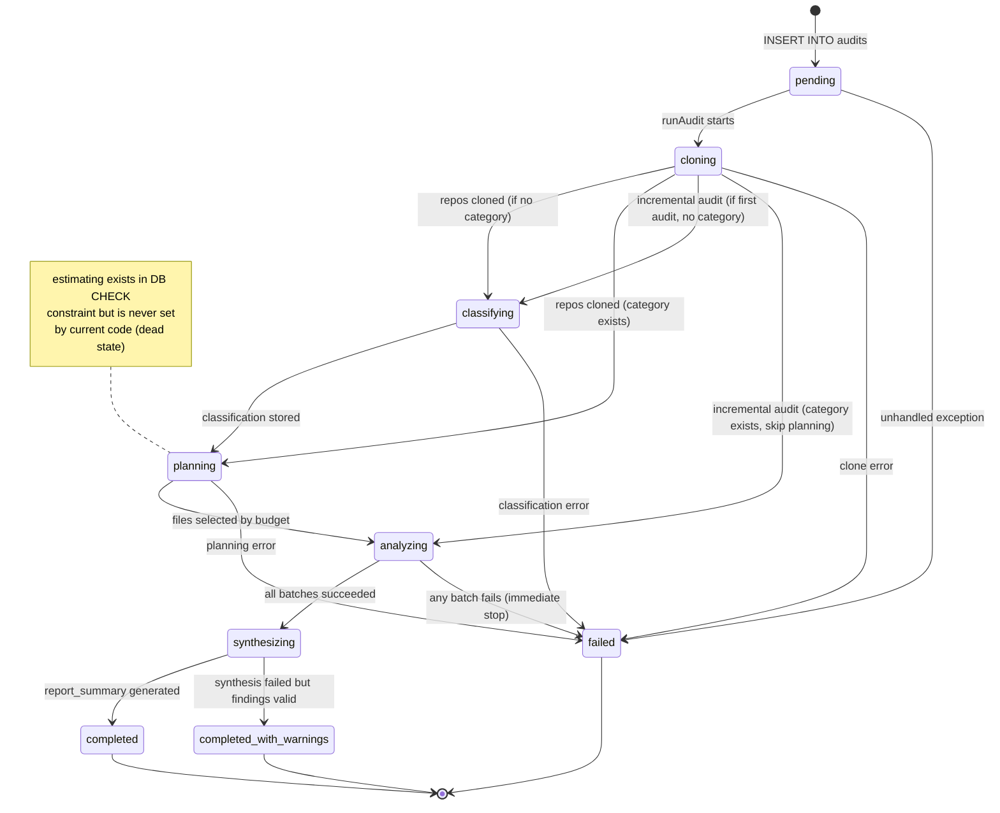
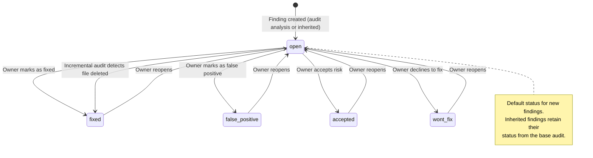
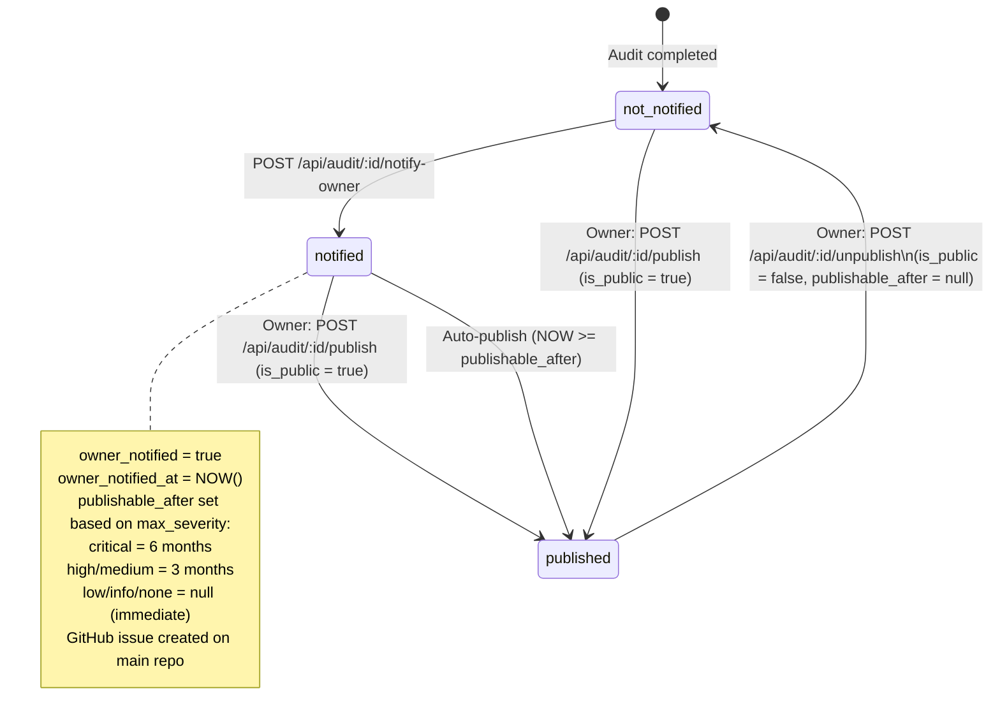
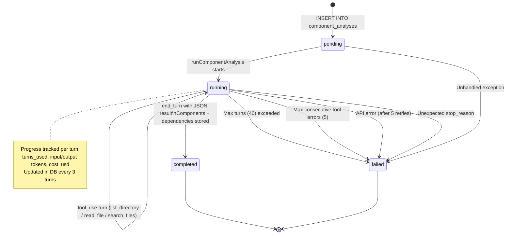

# State Machine Diagrams

## 1. Audit Status

```mermaid
stateDiagram-v2
    [*] --> pending : INSERT INTO audits

    pending --> cloning : runAudit starts

    cloning --> classifying : repos cloned (if no category)
    cloning --> planning : repos cloned (category exists)

    classifying --> planning : classification stored

    planning --> analyzing : files selected by budget

    cloning --> classifying : incremental audit (if first audit, no category)
    cloning --> analyzing : incremental audit (category exists, skip planning)

    analyzing --> synthesizing : all batches succeeded
    analyzing --> failed : any batch fails (immediate stop)

    synthesizing --> completed : report_summary generated
    synthesizing --> completed_with_warnings : synthesis failed but findings valid

    cloning --> failed : clone error
    classifying --> failed : classification error
    planning --> failed : planning error
    note left of planning
        estimating exists in DB CHECK
        constraint but is never set
        by current code (dead state)
    end note
    pending --> failed : unhandled exception

    completed --> [*]
    completed_with_warnings --> [*]
    failed --> [*]
```

## 2. Finding Status

```mermaid
stateDiagram-v2
    [*] --> open : Finding created (audit analysis or inherited)

    open --> fixed : Owner marks as fixed
    open --> false_positive : Owner marks as false positive
    open --> accepted : Owner accepts risk
    open --> wont_fix : Owner declines to fix

    open --> fixed : Incremental audit detects file deleted

    fixed --> open : Owner reopens
    false_positive --> open : Owner reopens
    accepted --> open : Owner reopens
    wont_fix --> open : Owner reopens

    note right of open
        Default status for new findings.
        Inherited findings retain their
        status from the base audit.
    end note
```

## 3. Responsible Disclosure Lifecycle

```mermaid
stateDiagram-v2
    state "not_notified" as nn
    state "notified" as n
    state "published" as p

    [*] --> nn : Audit completed

    nn --> n : POST /api/audit/:id/notify-owner
    note right of n
        owner_notified = true
        owner_notified_at = NOW()
        publishable_after set based on max_severity:
          critical = 6 months
          high/medium = 3 months
          low/info/none = null (immediate)
        GitHub issue created on main repo
    end note

    n --> p : Owner: POST /api/audit/:id/publish (is_public = true)
    n --> p : Auto-publish (NOW >= publishable_after)

    nn --> p : Owner: POST /api/audit/:id/publish (is_public = true)

    p --> nn : Owner: POST /api/audit/:id/unpublish\n(is_public = false, publishable_after = null)
```

## 4. Component Analysis Status

```mermaid
stateDiagram-v2
    [*] --> pending : INSERT INTO component_analyses

    pending --> running : runComponentAnalysis starts

    running --> running : tool_use turn (list_directory / read_file / search_files)

    running --> completed : end_turn with JSON result\nComponents + dependencies stored

    running --> failed : Max turns (40) exceeded
    running --> failed : Max consecutive tool errors (5)
    running --> failed : API error (after 5 retries)
    running --> failed : Unexpected stop_reason

    pending --> failed : Unhandled exception

    completed --> [*]
    failed --> [*]

    note right of running
        Progress tracked per turn:
        turns_used, input/output tokens, cost_usd
        Updated in DB every 3 turns
    end note
```
