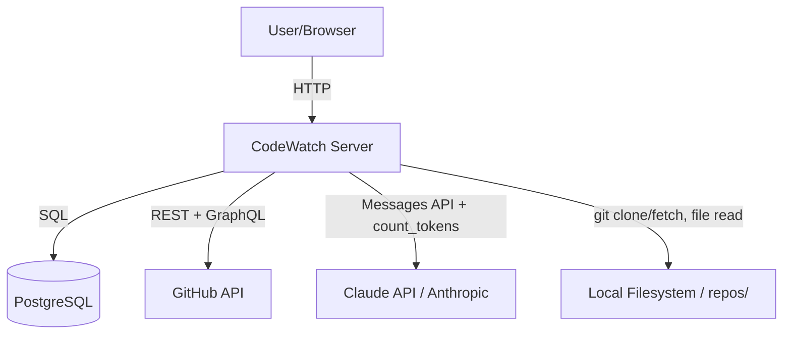

# System Context Diagram

Shows CodeWatch and its external dependencies.

```mermaid
graph TB
    User[User/Browser]
    CW[CodeWatch Server]
    PG[(PostgreSQL)]
    GH[GitHub API]
    Claude[Claude API / Anthropic]
    FS[Local Filesystem / repos/]

    User -->|HTTP| CW
    CW -->|SQL| PG
    CW -->|REST + GraphQL| GH
    CW -->|Messages API + count_tokens| Claude
    CW -->|git clone/fetch, file read| FS
```
